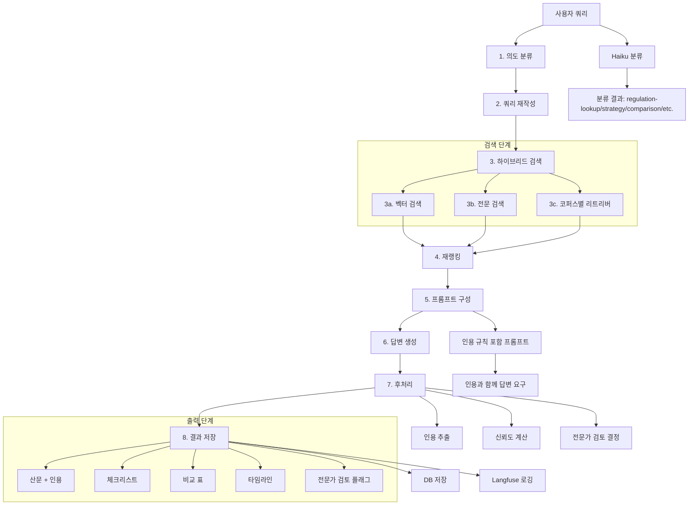
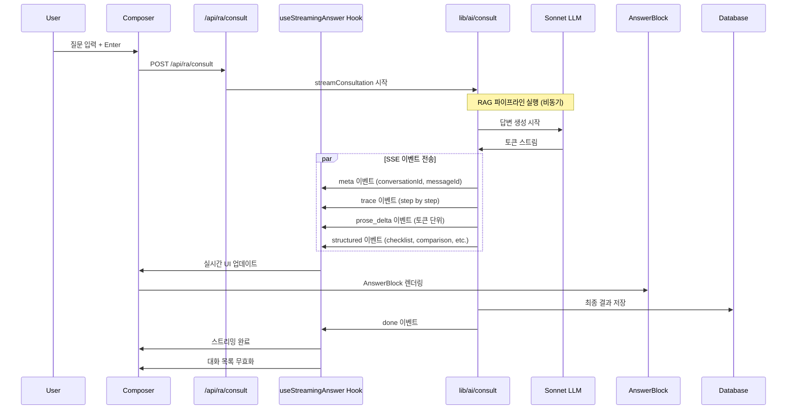
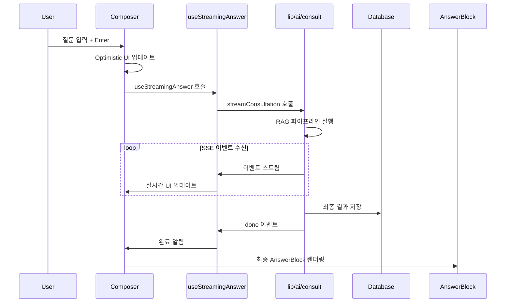
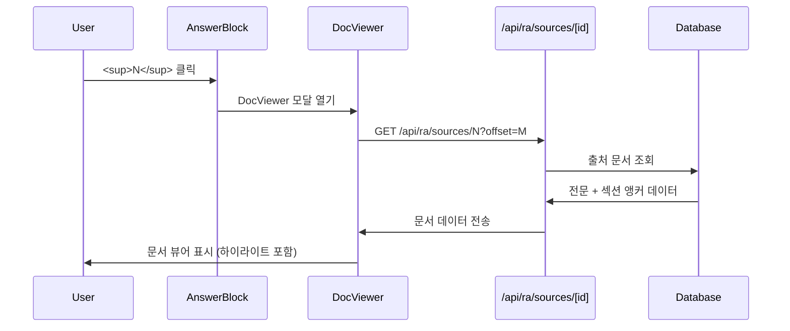
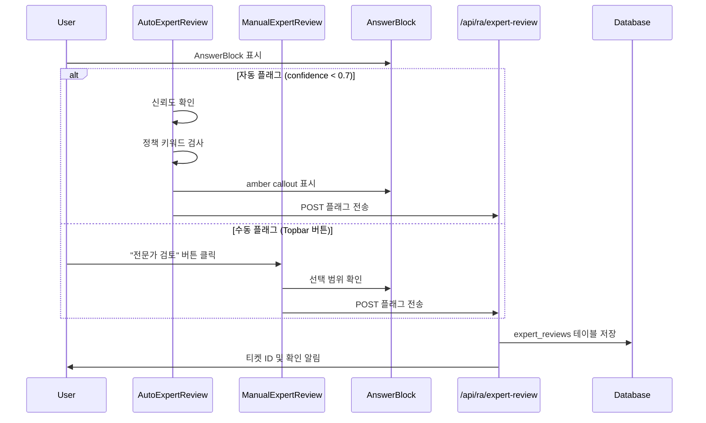
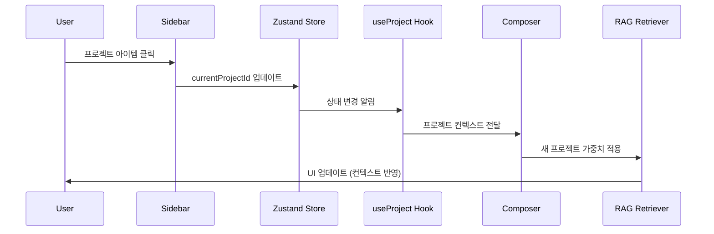
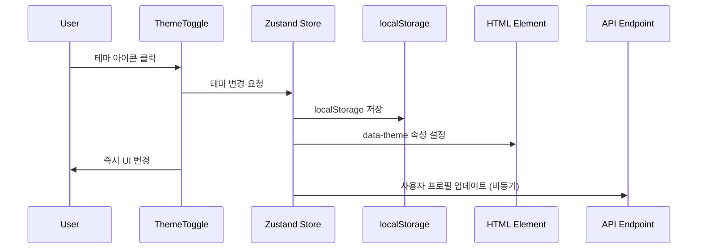
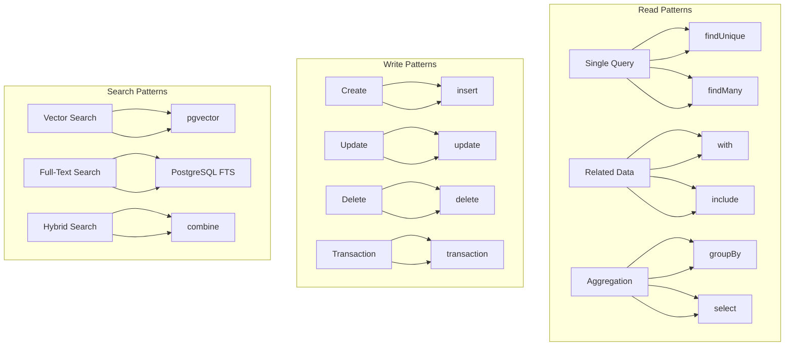
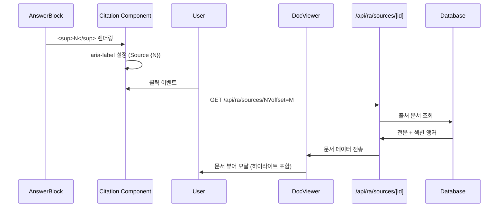

# 데이터 흐름 문서 — Regula

> 최종 업데이트: 2026-06-17
> 출처: 자동 생성된 코드베이스 분석
> 주요 데이터 흐름: 6개 카테고리 (RAG, SSE, 상호작용, DB, 인용, 게이팅)

---

## 데이터 흐름 개요

Regula 시스템은 복잡한 데이터 흐름을 가지며, RAG 파이프라인, SSE 스트리밍, 사용자 상호작용, 데이터베이스 패턴, 인용 해결, 전문가 검토 게이팅 6개 주요 흐름으로 구분됩니다. 각 흐름은 독립적이면서도 상호 연결되어 전체 시스템의 데이터 이동을 관리합니다.

### 데이터 흐름 분류 구조

```
┌─────────────────────────────────────────────────────────────────┐
│                      Data Flow Types                           │
│  ┌─────────────────┐  ┌─────────────────┐  ┌─────────────────┐ │
│  │ RAG Pipeline    │  │ Streaming Events│  │ User Interactions│ │
│  │ (8-step)       │  │ (SSE)          │  │ (5 scenarios)    │ │
│  └─────────────────┘  └─────────────────┘  └─────────────────┘ │
│  ┌─────────────────┐  ┌─────────────────┐  ┌─────────────────┐ │
│  │ Database        │  │ Citation       │  │ Expert Review   │ │
│  │ Queries         │  │ Resolution     │  │ Gating         │ │
│  └─────────────────┘  └─────────────────┘  └─────────────────┘ │
└─────────────────────────────────────────────────────────────────┘
```

---

## 1. RAG 파이프라인 데이터 흐름 (8단계)

### 전체 RAG 파이프라인 다이어그램


### 상세 단계별 데이터 흐름

#### 1. 의도 분류 (Intent Classification)
**입력**: 사용자 쿼리 + 컨텍스트  
**출력**: 분류 결과 (`regulation-lookup`, `strategy`, `comparison`, `etc.`)

```typescript
// lib/ai/classifier.ts
export async function classifyIntent(
  query: string, 
  projectId?: string
): Promise<IntentType> {
  const prompt = `다음 규제 질의의 의도를 분류해주세요:
  
Query: ${query}
Project: ${projectId || 'unknown'}

분류 결과:
- regulation-lookup: 규조문서 검색 요청
- strategy: 전략/조언 요청  
- comparison: 여러 관할권 비교
- procedure: 절문/프로세스 문의
- compliance: 규제 준수 확인
- other: 기타

분류 결과만 반환하세요.`

  const response = await haiku.invoke(prompt)
  return parseIntentResponse(response.content)
}
```

**데이터 변환**:
- 원본 쿼리 → 분석 → 의도 범주
- 프로젝트 컨텍스트 적용
- 분류 신뢰도 계산

---

#### 2. 쿼리 재작성 (Query Rewriting)
**입력**: 원본 쿼리 + 의도 분류 결과  
**출력**: 최적화된 검색 쿼리

```typescript
// lib/ai/rewriter.ts
export async function rewriteQuery(
  originalQuery: string,
  intent: IntentType
): Promise<string> {
  const prompt = `다음 규제 질의를 검색을 위해 최적화해주세요:

원본 쿼리: ${originalQuery}
의도: ${intent}

최적화 규칙:
1. 약어 확장 (예: FDA → "Food and Drug Administration")
2. 동의어 추가 (예: 규제 → 규정, 법령, 지침)
3. 검색어 분할 (복합어 → 단어 조합)
4. 영어/한국어 통합 (이중언어 처리)
5. 관련 개념 확장

검색 쿼리만 반환하세요.`

  const response = await haiku.invoke(prompt)
  return response.content.trim()
}
```

**데이터 변환**:
- 원본 → 확장된 검색어
- 언어 통합
- 의도별 최적화

---

#### 3. 하이브리드 검색 (Hybrid Search)
**입력**: 재작성된 쿼리 + 프로젝트 컨텍스트  
**출력**: 검색 결과 목록

```typescript
// lib/ai/retrievers/hybrid.ts
export async function hybridSearch(
  query: string,
  options: SearchOptions
): Promise<SearchResult[]> {
  const vectorResults = await vectorSearch(query, options)
  const ftsResults = await fullTextSearch(query, options)
  const corpusResults = await corpusSpecificSearch(query, options)
  
  // 결과 병합 및 중복 제거
  const combined = mergeResults([
    vectorResults,
    ftsResults, 
    corpusResults
  ])
  
  return combined
}

async function vectorSearch(query: string, options: SearchOptions) {
  const embedding = await openai.embeddings.create({
    input: query,
    model: 'text-embedding-3-small'
  })
  
  return db.query.sources.findMany({
    where: eq(schema.sources.embedding, embedding.data[0].embedding),
    limit: 10
  })
}
```

**데이터 변환**:
- 쿼리 → 벡터 임베딩
- 다중 검색 실행
- 결과 병합 및 정렬

---

#### 4. 재랭킹 (Re-ranking)
**입력**: 검색 결과 원본 + 쿼리  
**출력**: 정렬된 최종 결과

```typescript
// lib/ai/reranker.ts
export async function rerankResults(
  results: SearchResult[],
  query: string
): Promise<RankedResult[]> {
  // Cohere Rerank 사용
  const reranked = await cohere.rerank({
    documents: results.map(r => r.content),
    query: query,
    topN: results.length
  })
  
  return reranked.results.map((result, index) => ({
    ...results[result.index],
    relevanceScore: result.relevanceScore,
    rank: index
  }))
}
```

**데이터 변환**:
- 원본 결과 → 신뢰도 점수 할당
- 순위별 재정렬
- 최종 K개 결과 선택

---

#### 5. 프롬프트 구성 (Prompt Construction)
**입력**: 재랭킹된 결과 + 인용 규칙  
**출력**: 최종 프롬프트

```typescript
// lib/ai/prompts.ts
export function buildCitationPrompt(
  query: string,
  results: RankedResult[]
): string {
  const contextChunks = results.map((result, index) => `
출처 ${index + 1}: ${result.source.title}
내용: ${result.content}
관련도: ${result.relevanceScore}
`.trim()).join('\n\n')

  return `
다음 규제 질의에 답변해주세요. 답변 시 다음 규칙을 반드시 지키세요:

질문: ${query}

출처 정보:
${contextChunks}

답변 규칙:
1. 모든 사실적 주장에 반드시 <sup class="cite">N</sup> 형식으로 인용
2. 인용 번호는 출처 번호를 순서대로 사용
3. 출처 정보가 없는 추론은 허용되지 않음
4. 한국어로 답변하고, 전문 용어는 영어 원문 병기
5. 간결하고 명확한 답변 제공

답변:`
}
```

**데이터 변환**:
- 검색 결과 → 구조화된 컨텍스트
- 인용 규칙 적용
- 최종 프롬프트 생성

---

#### 6. 답변 생성 (Answer Generation)
**입력**: 최종 프롬프트  
**출력**: 구조화된 답변 (산문 + 인용)

```typescript
// lib/ai/consult.ts
export async function generateAnswer(
  prompt: string
): Promise<GeneratedAnswer> {
  const response = await sonnet.invoke(prompt, {
    stream: true,
    maxTokens: 2000
  })
  
  const content = await streamToString(response)
  const citations = extractCitations(content)
  const prose = removeCitations(content)
  
  return {
    prose,
    citations,
    confidence: await calculateConfidence(content, citations),
    expertReviewRequired: await shouldExpertReview(content)
  }
}

function extractCitations(content: string): Citation[] {
  const citationRegex = /<sup class="cite">(\d+)<\/sup>/g
  const matches = [...content.matchAll(citationRegex)]
  
  return matches.map((match, index) => ({
    id: `citation-${index}`,
    number: parseInt(match[1]),
    sourceId: `source-${match[1]}`,
    position: match.index
  }))
}
```

**데이터 변환**:
- 프롬프트 → 답변 생성
- 인용 추출 및 정리
- 신뢰도 계산

---

#### 7. 후처리 (Post-processing)
**입력**: 생성된 답변 + 검색 결과  
**출력**: 최종 구조화된 출력

```typescript
// lib/ai/postprocessor.ts
export async function postprocessAnswer(
  answer: GeneratedAnswer,
  sources: Source[]
): Promise<StructuredAnswer> {
  const checklist = await generateChecklist(answer.prose, sources)
  const comparison = await generateComparison(answer.prose, sources)
  const timeline = await generateTimeline(answer.prose, sources)
  const followups = await generateFollowups(answer.prose, sources)
  
  return {
    prose: answer.prose,
    citations: answer.citations,
    checklist,
    comparison,
    timeline,
    followups,
    confidence: answer.confidence,
    expertReviewRequired: answer.expertReviewRequired
  }
}
```

**데이터 변환**:
- 단순 답변 → 구조화된 블록
- 체크리스트 생성
- 비교 표 생성
- 타임라인 생성
- 후속 질문 제안

---

#### 8. 결과 저장 (Result Storage)
**입력**: 최종 구조화된 출력  
**출력**: DB 저장 완료

```typescript
// lib/db/queries.ts
export async function saveConversationResult(
  result: StructuredAnswer,
  conversationId: string,
  messageId: string
): Promise<void> {
  await transaction(async (tx) => {
    // 메시지 저장
    await tx.insert(schema.messages).values({
      id: messageId,
      conversation_id: conversationId,
      role: 'assistant',
      content_prose: result.prose,
      confidence_level: result.confidence.level,
      confidence_score: result.confidence.score,
      expert_review_required: result.expertReviewRequired,
      created_at: new Date()
    })
    
    // 출처 매핑 저장
    const messageSources = result.citations.map(citation => ({
      message_id: messageId,
      source_id: citation.sourceId,
      relevance_score: 0.8, // TODO: 실제 신뢰도 계산
      quoted_offset: citation.position,
      cited_index: citation.number
    }))
    
    await tx.insert(schema.message_sources).values(messageSources)
    
    // 구조화 블록 저장
    const blocks = [
      { type: 'checklist', content: JSON.stringify(result.checklist) },
      { type: 'comparison', content: JSON.stringify(result.comparison) },
      { type: 'timeline', content: JSON.stringify(result.timeline) },
      { type: 'related', content: JSON.stringify(result.followups) }
    ]
    
    await tx.insert(schema.message_blocks).values(
      blocks.map(block => ({
        message_id: messageId,
        block_type: block.type as BlockType,
        block_json: block.content
      }))
    )
  })
}
```

**데이터 변환**:
- 출력 데이터 → DB 스키마 매핑
- 트랜잭션 처리
- 관계 데이터 저장

---

## 2. SSE 스트리밍 이벤트 시퀀스

### 스트리밍 다이어그램


### 이벤트 타입별 데이터 처리

#### meta 이벤트 (스트림 시작)
```typescript
// Event: { type: 'meta', conversationId: string, messageId: string }
const handleMeta = (event: MetaEvent) => {
  setConversationId(event.conversationId)
  setMessageId(event.messageId)
  setStatus('streaming')
  setTraceSteps([])
  setProse('')
  setStructured(null)
}
```

**데이터 처리**:
- 세션 ID 설정
- 초기 상태 초기화
- 메타데이터 저장

---

#### trace 이벤트 (검색 진행)
```typescript
// Event: { type: 'trace', step: string, status: 'active'|'done' }
const handleTrace = (event: TraceEvent) => {
  setTraceSteps(prev => {
    const updated = [...prev, { ...event, timestamp: Date.now() }]
    // 각 단계는 500ms 이상 간격을 가져야 함
    return updated.filter((step, index) => 
      index === 0 || step.timestamp - updated[index-1].timestamp >= 500
    )
  })
}
```

**데이터 처리**:
- 단계별 진행 표시
- 타임스탬프 추적
- 퍼셉션을 위한 지연 적용

---

#### prose_delta 이벤트 (답변 스트리밍)
```typescript
// Event: { type: 'prose_delta', delta: string }
const handleProseDelta = (event: ProseDeltaEvent) => {
  setProse(prev => prev + event.delta)
  // 마지막 토큰 처리
  const fullText = prev + event.delta
  if (shouldExtractCitations(fullText)) {
    const citations = extractCitations(fullText)
    updateCitations(citations)
  }
}
```

**데이터 처리**:
- 토큰 누적
- 인용 실시간 추출
- UI 스냅샷 업데이트

---

#### structured 이벤트 (구조화 데이터)
```typescript
// Event: { type: 'confidence', data: { level: 'high'|'med'|'low', score: number } }
// Event: { type: 'sources', data: { items: Source[] } }
// Event: { type: 'checklist', data: { items: ChecklistItem[] } }

const handleStructured = (event: StructuredEvent) => {
  switch (event.type) {
    case 'confidence':
      setStructured(prev => ({ ...prev, confidence: event.data }))
      break
    case 'sources':
      setStructured(prev => ({ ...prev, sources: event.data.items }))
      break
    case 'checklist':
      setStructured(prev => ({ ...prev, checklist: event.data.items }))
      break
    // ... 기타 이벤트 타입
  }
}
```

**데이터 처리**:
- 구조화 데이터 병합
- 부분적 상태 업데이트
- UI 컴포넌트 트리거

---

#### done 이벤트 (스트림 완료)
```typescript
// Event: { type: 'done', duration_ms: number }
const handleDone = (event: DoneEvent) => {
  setStatus('completed')
  // 캐시 저장
  cacheConversation(conversationId, {
    prose,
    structured,
    traceSteps,
    duration: event.duration_ms
  })
  // TanStack Query 무효화
  queryClient.invalidateQueries({ queryKey: ['conversations'] })
}
```

**데이터 처리**:
- 최종 상태 저장
- 캐시 업데이트
- 관련 쿼리 무효화

---

## 3. 사용자 상호작용 데이터 흐름 (5가지 시나리오)

### 시나리오 1: 규제 질의 제출


**데이터 흐름**:
1. **입력 처리**: 사용자 질문 → Composer 컴포넌트
2. **예측 업데이트**: 즉시 UI 업데이트
3. **스트리밍 시작**: SSE 연결 설정
4. **실시간 렌더링**: 이벤트별 UI 업데이트
5. **저장 완료**: DB 저장 및 캐시

---

### 시나리오 2: Citation 클릭


**데이터 흐름**:
1. **인식 처리**: 클릭 이벤트 → Citation 컴포넌트
2. **모달 열기**: DocViewer 모식
3. **API 요청**: 출처 정보 조회
4. **데이터 페칭**: DB 원문 조회
5. **디스플레이**: 하이라이트 포함 문서 뷰어

---

### 시나리오 3: Expert review 플래그


**데이터 흐름**:
1. **조건 검사**: 신뢰도 + 정책 키워드
2. **플래그 결정**: 자동/수동 플래그
3. **UI 업데이트**: Callout 표시
4. **API 요청**: 전문가 검토 큐 등록
5. **알림 표시**: 사용자 피드백

---

### 시나리오 4: 프로젝트 전환


**데이터 흐름**:
1. **선택 처리**: 프로젝트 선택 이벤트
2. **상태 업데이트**: Zustand store 업데이트
3. **컨텍스트 전파**: 관련 컴포넌트에 전달
4. **RAG 업데이트**: 검색 가중치 재조정
5. **UI 재반영**: 컨텍스트 기반 UI 업데이트

---

### 시나리오 5: 다크모드 전환


**데이터 흐름**:
1. **이벤트 처리**: 테마 전환 이벤트
2. **상태 관리**: Zustand store 업데이트
3. **지속성 저장**: localStorage 저장
4. **DOM 업데이트**: HTML 클래스 변경
5. **서버 동기화**: 사용자 프로필 업데이트

---

## 4. 데이터베이스 쿼리 패턴

### 쿼리 패턴 다이어그램


### 주요 쿼리 패턴

#### 1. 단일 항목 조회
```typescript
// lib/db/queries.ts
export async function getConversationById(id: string) {
  return db.query.conversations.findUnique({
    where: { id },
    include: {
      messages: {
        orderBy: { created_at: 'asc' },
        include: {
          sources: true,
          blocks: true
        }
      },
      project: {
        select: { name: true, device_class: true }
      },
      user: {
        select: { name: true, email: true }
      }
    }
  })
}
```

**패턴 특징**:
- 단일 레코드 조회
- 관계 데이터 포함
- 정렬 및 필터링
- 선택적 프로젝션

---

#### 2. 관련 데이터 포함
```typescript
export async function getConversationsByProject(
  projectId: string,
  options: PaginationOptions
) {
  return db.query.conversations.findMany({
    where: { project_id: projectId },
    orderBy: { created_at: 'desc' },
    take: options.limit,
    skip: options.offset,
    include: {
      messages: {
        select: { 
          id: true, 
          role: true, 
          content_prose: true,
          created_at: true 
        }
      }
    }
  })
}
```

**패턴 특징**:
- 1:N 관계 조회
- 페이징 처리
- 최소 필요 선택
- 성능 최적화

---

#### 3. 벡터 검색
```typescript
export async function semanticSearch(
  query: string, 
  limit: number = 10
) {
  const embedding = await openai.embeddings.create({
    input: query,
    model: 'text-embedding-3-small'
  })
  
  return db.query.sources.findMany({
    where: sql`${schema.sources.embedding} <-> ${embedding.data[0].embedding} < 0.75`,
    orderBy: [sql`(${schema.sources.embedding} <-> ${embedding.data[0].embedding})`],
    limit: limit
  })
}
```

**패턴 특징**:
- 벡터 유사도 검색
- 거리 기반 정렬
- 유사도 임계값 설정
- 인덱스 활용

---

#### 4. 트랜잭션 처리
```typescript
export async function createConversationWithMessage(
  data: CreateConversationData
) {
  return db.transaction(async (tx) => {
    const conversation = await tx.insert(schema.conversations).values({
      title: data.title,
      project_id: data.projectId,
      user_id: data.userId,
      status: 'active'
    }).returning()
    
    const message = await tx.insert(schema.messages).values({
      conversation_id: conversation[0].id,
      role: 'user',
      content_prose: data.question,
      created_at: new Date()
    }).returning()
    
    return { conversation: conversation[0], message: message[0] }
  })
}
```

**패턴 특징**:
- 원자성 작업
- 롤백 처리
- 관계 데이터 일관성
- 에러 처리

---

#### 5. 하이브리드 검색
```typescript
export async function fullTextSearch(
  query: string,
  options: SearchOptions
) {
  const ftsResults = await db.query.sources.findMany({
    where: sql`${schema.sources.fullText} @@ websearch_to_tsquery(${query})`,
    orderBy: [
      sql`ts_rank_cd(${schema.sources.fullText}, websearch_to_tsquery(${query})) DESC`
    ],
    limit: options.limit
  })
  
  const vectorResults = await semanticSearch(query, options.limit)
  
  return mergeAndDedupeResults(ftsResults, vectorResults)
}
```

**패턴 특징**:
- 다중 검색 전략
- 결과 병합 및 중복 제거
- 가중치 적용
- 성능 최적화

---

## 5. 인용 해결 데이터 흐름

### 인용 해석 다이어그램


### 인용 처리 흐름

#### 1. 인식 추출
```typescript
// lib/ai/citations.ts
export function extractCitations(content: string): Citation[] {
  // HTML 인용 태그 추출
  const citationRegex = /<sup class="cite">(\d+)<\/sup>/g
  const matches = [...content.matchAll(citationRegex)]
  
  return matches.map((match, index) => ({
    id: `citation-${index}`,
    number: parseInt(match[1]),
    sourceId: `source-${match[1]}`,
    position: match.index,
    length: match[0].length
  }))
}
```

**데이터 처리**:
- 정규식 기반 인식
- 위치 추적
- 번호 매핑

---

#### 2. 인용 매핑
```typescript
// lib/db/citations.ts
export async function mapCitationsToSources(
  citations: Citation[]
): Promise<MappedCitation[]> {
  const sourceIds = citations.map(c => c.sourceId)
  const sources = await db.query.sources.findMany({
    where: inArray(schema.sources.id, sourceIds)
  })
  
  return citations.map(citation => ({
    ...citation,
    source: sources.find(s => s.id === citation.sourceId)
  }))
}
```

**데이터 처리**:
- 출처 ID 조회
- 관계 데이터 가져오기
- 매핑 완성

---

#### 3. 딥링크 생성
```typescript
// hooks/useDocViewer.ts
export function useDocViewer() {
  const openDocViewer = (citation: Citation) => {
    const url = `/api/ra/sources/${citation.sourceId}?offset=${citation.position}`
    window.open(url, `docviewer-${citation.id}`)
  }
  
  return { openDocViewer }
}
```

**데이터 처리**:
- URL 생성
- 새 창 열기
- 딥링크 지원

---

#### 4. 문서 하이라이트
```typescript
// components/DocViewer.tsx
export function DocViewer({ sourceId, offset }: DocViewerProps) {
  const [source, setSource] = useState<Source | null>(null)
  const [highlightedContent, setHighlightedContent] = useState('')
  
  useEffect(() => {
    fetch(`/api/ra/sources/${sourceId}?offset=${offset}`)
      .then(res => res.json())
      .then(data => {
        setSource(data)
        const highlighted = highlightText(data.content, offset)
        setHighlightedContent(highlighted)
      })
  }, [sourceId, offset])
  
  return (
    <div className="doc-viewer">
      <div 
        className="highlighted-text"
        dangerouslySetInnerHTML={{ __html: highlightedContent }}
      />
    </div>
  )
}
```

**데이터 처리**:
- 텍스트 하이라이트
- DOM 삽입
- 스크롤 위치

---

## 6. 전문가 검토 게이팅 데이터 흐름

### 게이팅 결정 다이어그램
```mermaid
graph TD
    A[답변 생성 완료] --> B{신뢰도 확인}
    B --> C{confidence_score < 0.7}
    
    subgraph "자동 플래그"
        C -->|true| D[플래그 설정]
        C -->|false| E{정책 키워드 검사}
        
        E --> F{contains "임상시험 면제"}
        E --> G{contains "응급"}
        E --> H{기타 차단 키워드}
        
        F --> I[플래그 설정]
        G --> I
        H --> I
        
        D --> J[amber callout 표시]
        I --> J
    end
    
    subgraph "수동 플래그"
        K[사용자 선택] --> L[Topbar 버튼 클릭]
        L --> M[플래그 설정]
        M --> J
    end
    
    J --> N[/api/ra/expert-review POST]
    N --> O[expert_reviews 테이블 저장]
    O --> P[RA 리드 알림]
    P --> Q[검토 큐에 추가]
```

### 게이팅 처리 흐름

#### 1. 자동 플래그 조건
```typescript
// lib/ai/expert-review.ts
export async function shouldAutoFlag(
  answer: GeneratedAnswer,
  query: string
): Promise<{ shouldFlag: boolean, reason: string }> {
  // 신뢰도 조건
  if (answer.confidence.score < 0.7) {
    return { shouldFlag: true, reason: 'low_confidence' }
  }
  
  // 정책 차단 키워드
  const blockedKeywords = [
    '임상시험 면제',
    '응급',
    '위기 대응',
    '인간 시험',
    '생체 재료'
  ]
  
  const hasBlockedKeyword = blockedKeywords.some(keyword => 
    query.includes(keyword) || answer.prose.includes(keyword)
  )
  
  if (hasBlockedKeyword) {
    return { shouldFlag: true, reason: 'policy_blocked' }
  }
  
  return { shouldFlag: false, reason: '' }
}
```

**데이터 처리**:
- 신뢰도 계산
- 키워드 매칭
- 플래그 결정

---

#### 2. 전문가 검토 큐 등록
```typescript
// lib/db/queries.ts
export async function addToExpertReviewQueue(
  data: ExpertReviewData
): Promise<ExpertReviewTicket> {
  return db.transaction(async (tx) => {
    const ticket = await tx.insert(schema.expert_reviews).values({
      conversation_id: data.conversationId,
      requested_by: data.userId,
      assigned_to: null, // RA 팀이 할당
      status: 'queued',
      reason: data.reason,
      priority: calculatePriority(data.reason),
      created_at: new Date()
    }).returning()
    
    // 알림 발송 (이벤트 또는 웨벡)
    await notifyExpertTeam(ticket[0])
    
    return ticket[0]
  })
}
```

**데이터 처리**:
- 티켓 생성
- 우선순위 할당
- 알림 전송

---

#### 3. 검토 상태 관리
```typescript
// api/ra/expert-review/route.ts
export async function PATCH(
  request: Request,
  { params }: { params: { id: string } }
) {
  const data = await request.json()
  
  const update = await db.query.expert_reviews.findFirst({
    where: eq(schema.expert_reviews.id, params.id),
    with: {
      conversation: {
        include: {
          messages: true
        }
      }
    }
  })
  
  if (update.status === 'completed') {
    return Response.json({ error: 'Already completed' }, { status: 400 })
  }
  
  const updated = await db.update(schema.expert_reviews)
    .set({
      assigned_to: data.assignedTo,
      status: data.status,
      notes: data.notes,
      completed_at: data.status === 'completed' ? new Date() : null
    })
    .where(eq(schema.expert_reviews.id, params.id))
    .returning()
  
  // 상태 변경 알림
  await notifyStatusChange(updated[0])
  
  return Response.json(updated[0])
}
```

**데이터 처리**:
- 상태 업데이트
- 알림 처리
- 완료 시간 기록

---

## 데이터 흐름 최적화 전략

### 1. 캐싱 전략
- **TanStack Query**: 서버 상태 캐싱
- **Zustand**: 클라이언트 상태 캐싱
- **localStorage**: 영구 상태 저장
- **임시 캐시**: 세션 기반 데이터 저장

### 2. 성능 최적화
- **페이징**: 대용량 데이터 분할
- **지연 로딩**: 필요한 데이터만 로드
- **가상화**: 긴 리스트 최적화
- **인덱스**: 데이터베이스 인덱싱

### 3. 데이터 일관성
- **트랜잭션**: 원자성 보장
- **무효화**: 캐시 무효화 전략
- **동기화**: 실시간 데이터 동기화
- **백업**: 정기적 데이터 백업

### 4. 오류 처리
- **재시도**: 실패한 요청 재시도
- **회로 차단**: 실패 시 회로 차단기
- **Fallback**: 대체 데이터 제공
- **모니터링**: 오류 추적 및 알림

---

## 관련 핸드오프 섹션

- §11 Backend Integration & API Contracts — API 엔드포인트 및 스트리밍 계약
- §9 Interactions & Behavior — 사용자 상호작용 패턴
- §8 Shared Components — 공유 컴포넌트 데이터 흐름
- §12 Data Models — 데이터 모델 설계
- §16 Security & Compliance — 데이터 보안 및 감사 로그