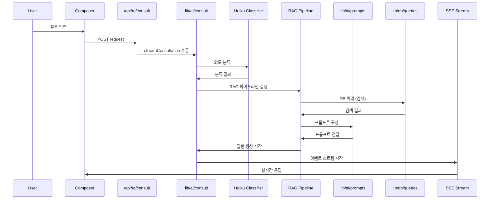

# 진입점 문서 — Regula

> 최종 업데이트: 2026-04-30
> 출처: `RA-bot-design/design_handoff_regula/README.md`

---

## 진입점 개요

Regula 애플리케이션은 7개 주요 진입점을 가지며, 각 진입점은 명확한 책임과 실행 흐름을 가집니다. 이 문서는 각 진입점의 역할, API 계약, 그리고 의존성 관계를 상세히 설명합니다.

### 진입점 분류 구조

```
┌─────────────────────────────────────────────────────────────────┐
│                      Entry Points                              │
│  ┌─────────────────┐  ┌─────────────────┐  ┌─────────────────┐ │
│  │ Application     │  │ API Routes      │  │ Streaming       │ │
│  │ Entry Points    │  │ Entry Points    │  │ Endpoint        │ │
│  └─────────────────┘  └─────────────────┘  └─────────────────┘ │
│  ┌─────────────────┐  ┌─────────────────┐  ┌─────────────────┐ │
│  │ Authentication  │  │ Database        │  │ Development     │ │
│  │ Entry Point     │  │ Migration       │  │ Tools           │ │
│  └─────────────────┘  └─────────────────┘  └─────────────────┘ │
└─────────────────────────────────────────────────────────────────┘
```

---

## 1. 애플리케이션 진입점

### Root Layout (`app/layout.tsx`)
**경로**: `app/layout.tsx`  
**책임**: 애플리케이션 전체의 기본 레이아웃 및 글로벌 설정  
**의존성**: `components/primitives`, `lib/i18n`, `stores/ui`

```typescript
// Root Layout 구조
export default function RootLayout({
  children,
}: {
  children: React.ReactNode
}) {
  return (
    <html lang="ko" className={theme}>
      <body className="font-sans">
        <Providers>{children}</Providers>
      </body>
    </html>
  )
}
```

**주요 기능**:
- HTML 구조 설정 (lang, theme 클래스)
- 글로벌 CSS 적용 (`globals.css`)
- Provider 설정 (상태 관리, 인증)
- 글로벌 폰트 및 메타데이터

**실행 흐름**:
1. `i18n` 설정 적용
2. `stores/ui` 테마 설정
3. 글로벌 스타일 적용
4. 자식 컴포넌트 렌더링

### App Shell Layout (`app/(app)/layout.tsx`)
**경로**: `app/(app)/layout.tsx`  
**책임**: 인증 후 애플리케이션 셸 구조  
**의존성**: `components/shell`, `hooks/useTheme`, `lib/auth`

```typescript
// App Shell 구조
export default function AppLayout({
  children,
}: {
  children: React.ReactNode
}) {
  return (
    <div className="flex h-screen bg-background">
      <Sidebar />
      <div className="flex-1 flex flex-col">
        <Topbar />
        <main className="flex-1 overflow-auto">
          {children}
        </main>
      </div>
    </div>
  )
}
```

**주요 기능**:
- Sidebar와 Topbar 렌더링
- 메인 콘텐츠 영역 배치
- 인증 검증 (Authentication Guard)
- 라우팅 그룹 관리

**실행 흐름**:
1. 인증 상태 확인 (`lib/auth`)
2. Sidebar 렌더링 (프로젝트 네비게이션)
3. Topbar 렌더링 (브레드크럼, 제어 요소)
4. 자식 페이지 렌더링

### Home Page (`app/(app)/page.tsx`)
**경로**: `app/(app)/page.tsx`  
**책임**: 홈 화면 렌더링 및 빠른 시작 기능  
**의존성**: `components/views/HomeView`, `hooks/useDashboard`, `stores/ui`

```typescript
// Home Page 컴포넌트
export default function HomePage() {
  const { onboardingDone } = useUI()
  
  return (
    <div className="container mx-auto py-8">
      {!onboardingDone ? (
        <OnboardingModal />
      ) : (
        <HomeView />
      )}
    </div>
  )
}
```

**주요 기능**:
- 온보딩 모달 표시
- 최근 상담 목록 표시
- 빠른 시작 그리드
- 프로젝트 컨텍스트 표시

---

## 2. API 라우트 진입점

### RAG Consult 엔드포인트 (`app/api/ra/consult/route.ts`)
**경로**: `app/api/ra/consult/route.ts`  
**메서드**: POST  
**책임**: 메인 RAG 처리 및 SSE 스트리밍  
**의존성**: `lib/ai/consult`, `lib/db/queries`, `lib/ai/expert-review`

**API 계약**:
```typescript
// 요청 타입
interface ConsultRequest {
  question: string
  conversationId?: string
  projectId?: string
  sourceFilter: 'all' | 'regs' | 'internal'
  attachments?: { fileId: string }[]
  locale: 'ko' | 'en'
}

// 응답 타입 (SSE)
interface ConsultResponse {
  type: 'meta' | 'trace' | 'prose_delta' | 'confidence' | 'sources' | 'checklist' | 'comparison' | 'timeline' | 'related' | 'expert_review_required' | 'done' | 'error'
  data: any
}
```

**실행 흐름**:


**주요 기능**:
- 쿼리 전처리 및 검증
- 8단계 RAG 파이프라인 실행
- SSE 스트리밍 처리
- 구조화 데이터 전송
- 전문가 검토 플래그 판정

### Conversations 엔드포인트 (`app/api/ra/conversations/route.ts`)
**경로**: `app/api/ra/conversations/route.ts`  
**메서드**: GET  
**책임**: 대화 목록 조회 및 필터링  
**의존성**: `lib/db/queries`, `lib/auth`

**API 계약**:
```typescript
// 요청 파라미터
interface ConversationsQuery {
  projectId?: string
  status?: 'active' | 'archived'
  q?: string // 검색어
  page?: number
  limit?: number
}

// 응답 타입
interface ConversationsResponse {
  conversations: Conversation[]
  total: number
  page: number
  hasMore: boolean
}
```

**주요 기능**:
- 대화 목록 페이징 처리
- 프로젝트별 필터링
- 상태별 필터링 (active/archived)
- 전문 검색 (제목, 내용)
- 권한 검사

### Source Viewer 엔드포인트 (`app/api/ra/sources/[id]/route.ts`)
**경로**: `app/api/ra/sources/[id]/route.ts`  
**메서드**: GET  
**책임**: 출처 문서 전문 및 섹션 앵커 제공  
**의존성**: `lib/db/queries`, `lib/auth`

**API 계약**:
```typescript
// 요청 파라미터
interface SourceQuery {
  offset?: number // 딥링크 오프셋
}

// 응답 타입
interface SourceResponse {
  id: string
  orgLabel: string
  title: string
  year: number
  type: 'Regulation' | 'Guidance' | 'Standard' | 'Industry' | 'Internal'
  region: string
  content: string
  sections: SourceSection[]
  metadata: SourceMetadata
}
```

**주요 기능**:
- 출처 문서 전문 반환
- 섹션 앵커 제공 (디렉트 링크 지원)
- 출처 메타데이터 포함
- 접근 권한 검사
- 딥링크 지원 (`?offset=N`)

### Expert Review 엔드포인트 (`app/api/ra/expert-review/route.ts`)
**경로**: `app/api/ra/expert-review/route.ts`  
**메서드**: POST  
**책임**: 전문가 검토 큐 등록 및 관리  
**의존성**: `lib/db/queries`, `lib/auth`, `lib/ai/expert-review`

**API 계약**:
```typescript
// 요청 타입
interface ExpertReviewRequest {
  conversationId: string
  messageIds?: string[]
  reason: string
  priority: 'low' | 'medium' | 'high'
}

// 응답 타입
interface ExpertReviewResponse {
  ticketId: string
  status: 'queued' | 'assigned' | 'completed'
  estimatedTime: Date
}
```

**주요 기능**:
- 전문가 검토 티켓 생성
- 우선순위 및 상세 이유 기록
- RA 리드 팀 전달
 진행 상태 추적

---

## 3. 스트리밍 엔드포인트

### SSE 스트리밍 구현 (`hooks/useStreamingAnswer.ts`)
**경로**: `hooks/useStreamingAnswer.ts`  
**책임**: SSE 연결 관리 및 이벤트 처리  
**의존성**: `lib/ai/consult`, `stores/conversation`, `lib/auth`

**구조**:
```typescript
export function useStreamingAnswer() {
  const [status, setStatus] = useState<'idle' | 'connecting' | 'streaming' | 'completed' | 'error'>('idle')
  const [prose, setProse] = useState('')
  const [structured, setStructured] = useState<StructuredBlocks>()
  const [traceSteps, setTraceSteps] = useState<TraceStep[]>([])
  
  const streamAnswer = async (request: ConsultRequest) => {
    const response = await fetch('/api/ra/consult', {
      method: 'POST',
      headers: { 'Content-Type': 'application/json' },
      body: JSON.stringify(request)
    })
    
    const reader = response.body?.getReader()
    // SSE 이벤트 처리 로직
  }
  
  return { status, prose, structured, traceSteps, streamAnswer }
}
```

**이벤트 처리**:
```typescript
// 이벤트 타입 정의
type SSEEvent = 
  | { type: 'meta', data: { conversationId: string, messageId: string } }
  | { type: 'trace', data: { step: string, status: 'active' | 'done' } }
  | { type: 'prose_delta', data: { delta: string } }
  | { type: 'confidence', data: { level: 'high' | 'med' | 'low', score: number } }
  | { type: 'sources', data: { items: Source[] } }
  // ... 기타 이벤트 타입

// 이벤트 처리 함수
const processEvent = (event: SSEEvent) => {
  switch (event.type) {
    case 'meta':
      // 메타 정보 처리
      break
    case 'trace':
      // 검색 단계 처리
      break
    case 'prose_delta':
      // 토큰 스트리밍 처리
      break
    // ... 기타 이벤트 처리
  }
}
```

**주요 기능**:
- SSE 연결 설정 및 관리
- AbortController로 연결 제어
- 이벤트 스트림 파싱
- 상태 업데이트
- 오류 처리 및 재연결

---

## 4. 인증 진입점

### Login Page (`app/(auth)/login/page.tsx`)
**경로**: `app/(auth)/login/page.tsx`  
**책임**: 로그인 페이지 렌더링 및 인증 처리  
**의존성**: `lib/auth`, `components/primitives`, `stores/ui`

**구조**:
```typescript
export default function LoginPage() {
  const [isLoading, setIsLoading] = useState(false)
  const [error, setError] = useState<string | null>(null)
  
  const handleLogin = async (credentials: LoginCredentials) => {
    try {
      setIsLoading(true)
      await signIn('credentials', credentials)
      router.push('/app')
    } catch (err) {
      setError('인증에 실패했습니다.')
    }
  }
  
  return (
    <div className="min-h-screen flex items-center justify-center">
      <LoginForm onLogin={handleLogin} isLoading={isLoading} error={error} />
    </div>
  )
}
```

**주요 기능**:
- 로그인 폼 표시
- SSO 통합 (Google, Microsoft)
- 인증 상태 처리
- 오류 메시지 표시
- 리디렉션 로직

### SSO Callback Handler (`app/(auth)/sso/callback/route.ts`)
**경로**: `app/(auth)/sso/callback/route.ts`  
**책임**: SSO 콜백 처리 및 세션 생성  
**의존성**: `lib/auth`, `lib/db/queries`

**구조**:
```typescript
export async function GET(request: Request) {
  const { searchParams } = new URL(request.url)
  const code = searchParams.get('code')
  
  try {
    // SSO 토큰 교환
    const tokens = await exchangeCodeForTokens(code)
    
    // 사용자 정보 조회
    const user = await getUserInfo(tokens.accessToken)
    
    // 세션 생성
    await auth.createSession({
      userId: user.id,
      expires: new Date(Date.now() + 30 * 60 * 1000) // 30분
    })
    
    // MFA 확인 필요 여부
    if (!user.mfaEnabled) {
      redirect('/app')
    } else {
      redirect('/app/mfa-verify')
    }
  } catch (error) {
    // 오류 처리
    redirect('/login?error=auth_failed')
  }
}
```

**주요 기능**:
- SSO 토큰 교환
- 사용자 정보 조회
- 세션 생성
- MFA 확인
- 리디렉션 처리

---

## 5. 데이터베이스 진입점

### Drizzle 스키마 (`lib/db/schema.ts`)
**경로**: `lib/db/schema.ts`  
**책임**: 데이터베이스 스키마 정의 및 타입 안전성 보장  
**의존성**: `drizzle-orm`, `postgres`

**구조**:
```typescript
import { pgTable, varchar, text, timestamp, boolean, vector } from 'drizzle-orm/pg-core'

export const users = pgTable('users', {
  id: varchar('id', { length: 255 }).primaryKey(),
  email: varchar('email', { length: 255 }).notNull().unique(),
  name: varchar('name', { length: 255 }).notNull(),
  role: varchar('role', { length: 50 }).notNull().default('member'),
  locale: varchar('locale', { length: 10 }).notNull().default('ko'),
  themePref: varchar('theme_pref', { length: 20 }).notNull().default('light'),
  createdAt: timestamp('created_at').notNull().defaultNow()
})

export const sources = pgTable('sources', {
  id: varchar('id', { length: 255 }).primaryKey(),
  orgLabel: varchar('org_label', { length: 255 }).notNull(),
  title: text('title').notNull(),
  year: integer('year').notNull(),
  type: varchar('type', { length: 50 }).notNull(),
  region: varchar('region', { length: 50 }).notNull(),
  url: varchar('url', { length: 500 }).notNull(),
  fullText: text('full_text'),
  embedding: vector('embedding', { dimensions: 1536 })
})

export const conversations = pgTable('conversations', {
  id: varchar('id', { length: 255 }).primaryKey(),
  project_id: varchar('project_id', { length: 255 }).notNull(),
  user_id: varchar('user_id', { length: 255 }).notNull(),
  title: text('title').notNull(),
  status: varchar('status', { length: 20 }).notNull().default('active'),
  created_at: timestamp('created_at').notNull().defaultNow()
})
```

**주요 기능**:
- 12개 테이블 스키마 정의
- 타입 안전한 쿼리 생성
- 관계(Relations) 정의
- 인덱스 및 제약 조건 설정
- pgvector 통합

### 데이터베이스 클라이언트 (`lib/db/client.ts`)
**경로**: `lib/db/client.ts`  
**책임**: 데이터베이스 연결 풀 관리 및 쿼리 실행  
**의존성**: `drizzle-orm`, `postgres`, `@libsql/client`

**구조**:
```typescript
import { drizzle } from 'drizzle-orm/postgres-js'
import postgres from 'postgres'
import * as schema from './schema'

// 연결 풀 생성
const connectionString = process.env.DATABASE_URL!
const pool = postgres(connectionString, { max: 1 })

// 데이터베이스 클라이언트
export const db = drizzle(pool, {
  schema,
  logger: process.env.NODE_ENV === 'development'
})

// 쿼리 템플릿
export async function query<T>(template: TemplateStringsArray, ...args: any[]) {
  return pool.template(template, ...args) as Promise<T>
}

// 트랜잭션 처리
export async function transaction<T>(callback: (tx: typeof db) => Promise<T>) {
  return pool.transaction(async (tx) => {
    return callback(drizzle(tx, { schema }))
  })
}
```

**주요 기능**:
- 데이터베이스 연결 관리
- 트랜잭션 처리
- 쿼리 실행 최적화
- 연결 풀링
- 에러 처리

---

## 6. 마이그레이션 진입점

### Drizzle 마이그레이션 (`drizzle.config.ts`)
**경로**: `drizzle.config.ts`  
**책임**: 데이터베이스 마이그레이션 설정 관리  
**의존성**: `drizzle-kit`, `drizzle-orm`

**구조**:
```typescript
import type { Config } from 'drizzle-kit'

export default {
  schema: './lib/db/schema.ts',
  out: './drizzle',
  dialect: 'postgresql',
  dbCredentials: {
    url: process.env.DATABASE_URL!,
  },
  verbose: true,
  strict: true,
} satisfies Config
```

**주요 기능**:
- 마이그레이션 파일 생성 위치 설정
- 데이터베이스 종류 지정
- 연결 정보 관리
- 로딩 레벨 설정

### 마이그레이션 실행 스크립트 (`scripts/migrate.ts`)
**경로**: `scripts/migrate.ts`  
**책임**: 마이그레이션 실행 및 롤백  
**의존성**: `drizzle-orm`, `drizzle-kit`, `zod`

**구조**:
```typescript
import { drizzle } from 'drizzle-orm/postgres-js'
import postgres from 'postgres'
import * as schema from '../lib/db/schema'
import { migrate } from 'drizzle-orm/postgres-js/migrator'
import { config } from 'drizzle-kit'

async function runMigrations() {
  const connectionString = process.env.DATABASE_URL!
  const client = postgres(connectionString, { max: 1 })
  const db = drizzle(client, { schema })
  
  try {
    // 마이그레이션 실행
    await migrate(db, { migrationsFolder: './drizzle' })
    console.log('마이그레이션 완료')
  } catch (error) {
    console.error('마이그레이션 실패:', error)
    process.exit(1)
  }
}

runMigrations()
```

**주요 기능**:
- 마이그레이션 실행
- 롤백 처리
- 에러 핸들링
- 트랜잭션 관리

---

## 7. 개발 도구 진입점

### 개발 서버 (`package.json` scripts)
**경로**: `package.json`  
**책임**: 개발 환경 설정 및 실행  
**의존성**: `next`, `drizzle-kit`, `vitest`, `playwright`

**구조**:
```json
{
  "scripts": {
    "dev": "next dev",
    "build": "next build",
    "start": "next start",
    "lint": "biome check .",
    "format": "biome format .",
    "type-check": "tsc --noEmit",
    "db:generate": "drizzle-kit generate:sqlite",
    "db:migrate": "drizzle-kit migrate:sqlite",
    "db:studio": "drizzle-kit studio",
    "test": "vitest",
    "test:e2e": "playwright test",
    "test:coverage": "vitest run --coverage"
  }
}
```

**주요 기능**:
- 개발 서버 실행
- 빌드 및 배포
- 코드 품질 검사
- 데이터베이스 관리
- 테스트 실행

### 테스트 설정 (`vite.config.ts`)
**경로**: `vite.config.ts`  
**책임**: 테스트 환경 설정  
**의존성**: `vitest`, `@vitest/coverage-v8`, `@testing-library/react`

**구조**:
```typescript
import { defineConfig } from 'vitest/config'
import react from '@vitejs/plugin-react'
import { resolve } from 'path'

export default defineConfig({
  plugins: [react()],
  test: {
    globals: true,
    environment: 'jsdom',
    setupFiles: ['./src/test/setup.ts'],
    coverage: {
      provider: 'v8',
      reporter: ['text', 'json', 'html'],
      exclude: ['node_modules/', 'dist/']
    }
  },
  resolve: {
    alias: {
      '@': resolve(__dirname, 'src')
    }
  }
})
```

**주요 기능**:
- 테스트 환경 설정
- 커버리지 설정
- 모의(Mock) 설정
- 경로 별칭 설정
- 플러그인 설정

---

## 진입점 간 의존성 그래프

### 전체 의존성 흐름
```mermaid
graph TD
    A[User] --> B[login/page.tsx]
    A --> C[app/(app)/page.tsx]
    
    B --> D[sso/callback/route.ts]
    B --> E[lib/auth]
    
    C --> F[app/(app)/layout.tsx]
    C --> G[composer]
    
    F --> H[components/shell]
    F --> I[components/views]
    
    G --> J[/api/ra/consult]
    G --> K[useStreamingAnswer]
    
    J --> L[lib/ai/consult]
    J --> M[lib/db/queries]
    
    L --> N[lib/ai/retrievers]
    L --> O[lib/ai/prompts]
    
    M --> P[lib/db/schema]
    M --> Q[lib/db/client]
    
    P --> R[PostgreSQL]
    Q --> R
    
    K --> S[stores/conversation]
    K --> T[stores/ui]
```

### 실행 흐름 분석

#### 사용자 로그인 흐름
1. **사용자 접속** → `login/page.tsx` 표시
2. **인증 요청** → SSO 또는 크리덴셜 로그인
3. **콜백 처리** → `sso/callback/route.ts` 세션 생성
4. **리디렉션** → `app/(app)/` 메인 콘텐츠

#### 상담 처리 흐름
1. **질문 입력** → `composer` 컴포넌트
2. **API 호출** → `/api/ra/consult` 엔드포인트
3. **RAG 처리** → `lib/ai/consult` 8단계 처리
4. **스트리밍** → `useStreamingAnswer` 훅
5. **UI 업데이트** → `AnswerBlock` 컴포넌트 렌더링

#### 데이터베이스 접근 흐름
1. **쿼리 요청** → `lib/db/queries` 함수 호출
2. **스키마 검증** → `lib/db/schema` 타입 안전성 검사
3. **DB 연결** → `lib/db/client` 연결 풀링
4. **쿼리 실행** → PostgreSQL 쿼리 실행
5. **결과 반환** → 데이터 처리 및 반환

---

## 성능 고려사항

### 1. 초기 로딩 성능
- **코드 분할**: `next/dynamic`으로 무거운 컴포넌트 분리
- **지연 로딩**: 이미지 및 폰트 지연 로딩
- **캐싱**: 상태 관리 라이브러리 캐싱 활용

### 2. 실행 시간 최적화
- **연결 풀링**: 데이터베이스 연결 풀링
- **쿼리 최적화**: 인덱스 및 쿼리 튜닝
- **SSE 스트리밍**: 실시간 응답 지연 최소화

### 3. 메모리 관리
- **상태 최적화**: Zustand 선택자 사용
- **메모리 누수**: 이벤트 리스너 정리
- **가비지 컬렉션**: 불필요한 객체 생성 방지

---

## 관련 핸드오프 섹션

- §11 Backend Integration & API Contracts — API 엔드포인트 상세 설계
- §9 Interactions & Behavior — 상호작용 및 실행 흐름
- §10 State Management — 상태 관리 패턴
- §12 Data Models — 데이터 모델 설계
- §5 Project Structure — 프로젝트 구조 및 진입점