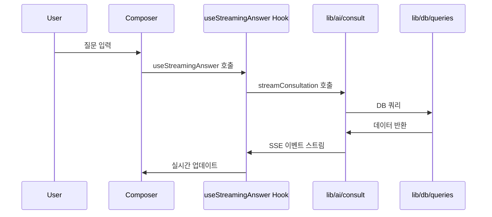
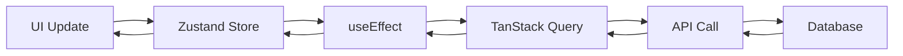
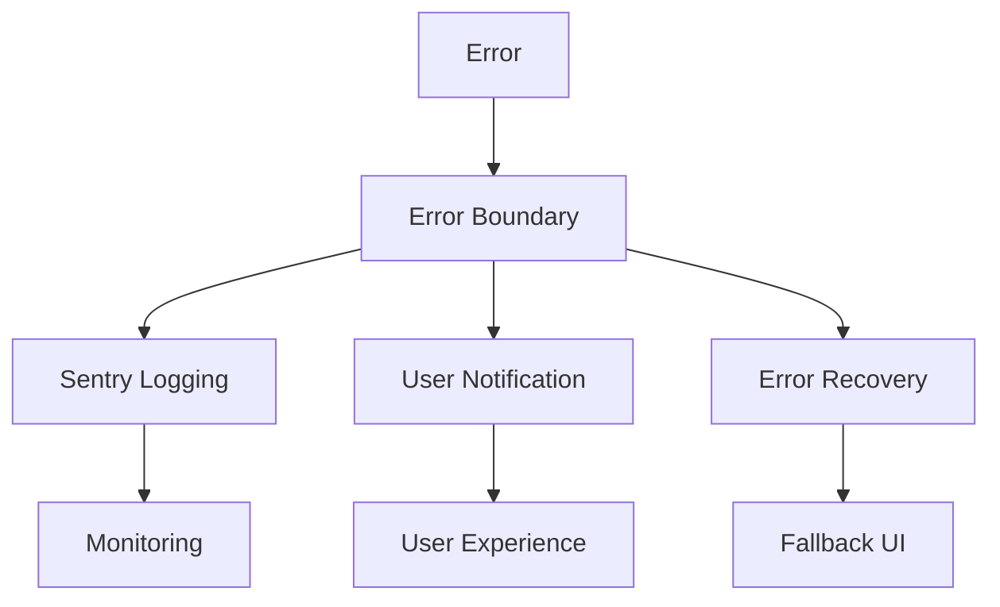

# 모듈 구조 — Regula

> 최종 업데이트: 2026-06-17
> 출처: 자동 생성된 코드베이스 분석
> 총 TypeScript 파일: 377개
> 주요 lib 모듈: 27개
> 주요 components 카테고리: 11개

---

## 모듈 개요

Regula는 12개 핵심 모듈로 구성된 모듈형 아키텍처를 따르며, 각 모듈은 명확한 책임과 공개 인터페이스를 가집니다. 모든 모듈은 TypeScript 5.4+로 작성되며, 의존성 그래프는 단방향으로 설계되어 순환 참조를 방지합니다.

### 모듈 계층 구조

```
┌─────────────────────────────────────────────────────────────────┐
│                      Presentation Layer                          │
│  components/shell/  components/chat/   components/views/        │
│  components/primitives/  components/onboarding/                 │
└─────────────────────────────────────────────────────────────────┘
                           ↑
                           ↓
┌─────────────────────────────────────────────────────────────────┐
│                      Application Layer                          │
│  app/(auth)/        app/(app)/        hooks/          stores/   │
│  API Route Handlers  UI Components    Custom Hooks    State Mgmt │
└─────────────────────────────────────────────────────────────────┘
                           ↑
                           ↓
┌─────────────────────────────────────────────────────────────────┐
│                       Domain Layer                             │
│  lib/ai/            lib/db/          lib/auth.ts                │
│  RAG Pipeline       Database Logic   Authentication Business   │
└─────────────────────────────────────────────────────────────────┘
```

---

## 모듈 상세 설명

### 1. app/(auth) 모듈
**위치**: `app/(auth)/`  
**책임**: 인증 및 인증 관련 페이지 처리  
**공개 인터페이스**: Next.js Route Handler + Page 컴포넌트

| 컴포넌트 | 경로 | 설명 |
|---|---|---|
| `login/page.tsx` | `/login` | 로그인 페이지 (SSO 지원) |
| `sso/callback/route.ts` | `/sso/callback` | SSO 콜백 처리 엔드포인트 |

**의존성**: 
- `lib/auth.ts` (Auth.js 설정)
- `components/primitives/*` (UI 기본 요소)

**주요 기능**:
- SAML/OIDC SSO 통합
- 세션 관리
- MFA 지원
- 30분 idle timeout

---

### 2. app/(app) 모듈
**위치**: `app/(app)/`  
**책임**: 인증 후 애플리케이션 메인 영역  
**공개 인터페이스**: Next.js App Router Route Groups + Layout

| 라우트 | 경로 | 설명 |
|---|---|---|
| `layout.tsx` | `/app/*` | Sidebar + Topbar 래퍼 (공통 layout) |
| `page.tsx` | `/app` | 홈 화면 |
| `chat/*` | `/app/chat*` | 상담 화면 (새 상담, 상세 상담) |
| `history/page.tsx` | `/app/history` | 상담 이록 |
| `templates/*` | `/app/templates*` | 템플릿 관리 |
| `knowledge/page.tsx` | `/app/knowledge` | 지식 베이스 |
| `updates/*` | `/app/updates*` | 규제 업데이트 |
| `dashboard/page.tsx` | `/app/dashboard` | 대시보드 |
| `projects/*` | `/app/projects*` | 프로젝트 관리 |
| `sources/*` | `/app/sources*` | 출처 관리 |
| `settings/page.tsx` | `/app/settings` | 설정 |

**의존성**:
- `components/shell/*` (Sidebar, Topbar)
- `components/views/*` (각 페이지 컴포넌트)
- `hooks/*` (커스텀 훅)
- `stores/*` (상태 관리)

**주요 기능**:
- 라우팅 제어
- 레이아웃 공유
- 테마 적용

---

### 3. components/shell 모듈
**위치**: `components/shell/`  
**책임**: 애플리케이션 셸 구성 요소 (전체 프레임워크)  
**공개 인터페이스**: React 컴포넌트 + 타입 정의

| 컴포넌트 | 설명 | 외부 의존성 |
|---|---|---|
| `Sidebar.tsx` | 왼쪽 네비게이션, 프로젝트 전환 | Zustand, `lib/db/projects` |
| `Topbar.tsx` | 브레드크럼, 테마 토글, 전문가 검토 | `lib/auth`, `lib/ai/expert-review` |
| `UserMenu.tsx` | 사용자 정보, 설정 메뉴 | `lib/auth`, `stores/ui` |

**의존성**:
- `components/primitives/*` (기본 UI 요소)
- `stores/ui.ts` (전역 상태)
- `lib/db/` (데이터베이스 쿼리)

**주요 기능**:
- 전체 앱 네비게이션
- 프로젝트 컨텍스트 관리
- 전역 상태 접근

---

### 4. components/chat 모듈
**위치**: `components/chat/`  
**책임**: 채팅 및 답변 관련 컴포넌트  
**공개 인터페이스**: React 컴포넌트 + 이벤트 핸들러

| 컴포넌트 | 설명 | 주요 기능 |
|---|---|---|
| `Composer.tsx` | 질문 입력 폼 | 스트리밍 시작, 파일 첨부 |
| `Thinking.tsx` | 분석 중 표시 | 단계별 진행 표시 |
| `AnswerBlock.tsx` | 답변 복합 컴포넌트 | 구조화 출력 렌더링 |
| `Citation.tsx` | 인용 표시 | 출처 문서 링크 |
| `SourceCard.tsx` | 출처 카드 | 출처 정보 표시 |
| `Checklist.tsx` | 체크리스트 | 완료 상태 추적 |
| `ComparisonTable.tsx` | 비교 표 | 관할권별 비교 |
| `Timeline.tsx` | 타임라인 | 제출 일정 관리 |
| `SuggestedFollowups.tsx` | 후속 질의 제안 | 관련 질문 제공 |
| `RightContextPanel.tsx` | 우측 패널 | 현재 프로젝트 정보 |

**의존성**:
- `hooks/useStreamingAnswer` (스트리밍 훅)
- `lib/ai/` (AI 로직)
- `components/primitives/*` (기본 요소)

**주요 기능**:
- 실시간 답변 표시
- 상호작용 처리
- 구조화 데이터 렌더링

---

### 5. components/views 모듈
**위치**: `components/views/`  
**책임**: 개별 페이지 컴포넌트  
**공개 인터페이스**: 페이지 컴포넌트 + 데이터 훅

| 컴포넌트 | 경로 | 설명 |
|---|---|---|
| `HomeView.tsx` | `/` | 환영 화면, 빠른 시작 |
| `HistoryView.tsx` | `/history` | 상담 이록 목록 |
| `TemplatesView.tsx` | `/templates` | 템플릿 브라우저 |
| `UpdatesView.tsx` | `/updates` | 규제 업데이트 피드 |
| `DashboardView.tsx` | `/dashboard` | 팀 지시표 |
| `SourcesView.tsx` | `/knowledge` | 지식 베이스 |
| `DocViewer.tsx` | 모달 | 문서 뷰어 |

**의존성**:
- `hooks/*` (데이터 훅)
- `components/shell/*` (셸 컴포넌트)
- `components/primitives/*` (기본 요소)

**주요 기능**:
- 페이지별 비즈니스 로직
- 데이터 가져오기
- 레이아웃 구성

---

### 6. components/primitives 모듈
**위치**: `components/primitives/`  
**책임**: 기본 UI 요소 (Radix UI 래핑)  
**공개 인터페이스**: 재사용 가능한 컴포넌트

| 컴포넌트 | 설명 | 접근성 기능 |
|---|---|---|
| `Button.tsx` | 버튼 | 키보드 네비게이션 |
| `IconButton.tsx` | 아이콘 버튼 | ARIA 레이블 |
| `Chip.tsx` | 칩 태그 | 선택 상태 |
| `Dialog.tsx` | 다이얼로그 | 모달 접근성 |
| `Dropdown.tsx` | 드롭다운 | 메뉴 네비게이션 |
| `Callout.tsx` | 알림 박스 | 경고 표시 |

**의존성**: Radix UI, `components/icons/Icon.tsx`

**주요 기능**:
- 접근성 보장
- 일관된 디자인 시스템
- 재사용성

---

### 7. lib/ai 모듈
**위치**: `lib/ai/`  
**책임**: AI/RAG 파이프라인 로직  
**공개 인터페이스**: 함수 인터페이스 + 타입 정의

| 모듈 | 설명 | 주요 함수 |
|---|---|---|
| `consult.ts` | 메인 RAG 오케스트레이션 | `streamConsultation` |
| `retrievers/` | 코퍼스별 리트리버 | `retrieveFDA`, `retrieveEUMDR` |
| `prompts.ts` | 프롬프트 템플릿 | `buildCitationPrompt` |
| `confidence.ts` | 신뢰도 평가 | `calculateConfidence` |
| `expert-review.ts` | 전문가 검토 플래그 | `shouldExpertReview` |
| `streaming.ts` | 스트리밍 유틸리티 | `SSEEventStream` |

**의존성**:
- `lib/db/` (데이터베이스 접근)
- `lib/ai/retrievers/*` (검색 리트리버)
- 외부 LLM API (abyz-lab SDK)

**주요 기능**:
- RAG 파이프라인 실행
- 의도 분류
- 검색 결과 처리
- 답변 생성

---

### 8. lib/db 모듈
**위치**: `lib/db/`  
**책임**: 데이터베이스 스키마 및 쿼리  
**공개 인터페이스**: 타입 안전한 쿼리 함수 + 스키마 정의

| 모듈 | 설명 | 주요 테이블 |
|---|---|---|
| `schema.ts` | Drizzle 스키마 정의 | 모든 DB 테이블 |
| `queries.ts` | 쿼리 함수 | CRUD 연산 |
| `client.ts` | DB 연결 설정 | 데이터베이스 클라이언트 |

**의존성**: Drizzle ORM, PostgreSQL, pgvector

**주요 기능**:
- 데이터 모델 관리
- 쿼리 실행
- 트랜잭션 처리
- RLS(Row-Level Security)

---

### 9. lib/auth 모듈
**위치**: `lib/auth.ts`  
**책임**: 인증 및 인가 로직  
**공개 인터페이스**: 인증 유틸리티 + 타입 정의

| 함수 | 설명 | 반환 타입 |
|---|---|---|
| `getSession()` | 현재 세션 정보 | `Session | null` |
| `requireAuth()` | 인증 요구 | `Promise<User>` |
| `hasPermission()` | 권한 확인 | `boolean` |

**의존성**: Auth.js v5, NextAuth

**주요 기능**:
- 세션 관리
- SSO 통합
- 권한 검사
- MFA 지원

---

### 10. hooks 모듈
**위치**: `hooks/`  
**책임**: 커스텀 React 훅  
**공개 인터페이스**: 훅 함수 + 반환 타입

| 훅 | 설명 | 의존성 |
|---|---|---|
| `useStreamingAnswer` | SSE 스트리밍 답변 | `lib/ai/consult` |
| `useConversation` | 대화 관리 | `lib/db/queries` |
| `useProject` | 프로젝트 컨텍스트 | `lib/db/projects` |
| `useTheme` | 테마 관리 | `stores/ui` |

**의존성**: TanStack Query, Zustand, `lib/ai/`, `lib/db/`

**주요 기능**:
- 상태 관리
- 데이터 동기화
- 부작용 처리
- 성능 최적화

---

### 11. stores 모듈
**위치**: `stores/`  
**책임**: 클라이언트 상태 관리  
**공개 인터페이스**: Zustand store 인스턴스

| 스토어 | 설명 | 상태 |
|---|---|---|
| `ui.ts` | UI 상태 관리 | 테마, 사이드바, 현재 프로젝트 |
| `conversation.ts` | 대화 상태 관리 | 메시지, 스트리밍 상태 |

**의존성**: Zustand, TanStack Query

**주요 기능**:
- 전역 상태 관리
- 상태 업데이트
- 선택자 함수

---

### 12. lib/i18n 모듈
**위치**: `lib/i18n.ts`  
**책임**: 국제화 지원  
**공개 인터페이스**: 번역 함수 + 로케일 설정

| 함수 | 설명 | 반환 타입 |
|---|---|---|
| `t()` | 번역 함수 | `string` |
| `setLocale()` | 로케일 설정 | `Promise<void>` |

**의존성**: next-intl, `stores/ui`

**주요 기능**:
- 다국어 지원
- 로케일 관리
- 번역 리소스

---

## 모듈 의존성 그래프

### 의존성 흐름 다이어그램
```mermaid
graph TD
    subgraph "Presentation Layer"
        A[app/(auth)] --> B[lib/auth]
        C[app/(app)] --> D[components/shell]
        C --> E[components/views]
        F[components/chat] --> G[hooks/useStreamingAnswer]
        F --> H[lib/ai]
        I[components/views] --> J[hooks/*]
    end
    
    subgraph "Application Layer"
        K[hooks/*] --> L[lib/db/queries]
        M[stores/*] --> N[lib/db/queries]
        O[lib/auth] --> P[lib/db/users]
    end
    
    subgraph "Domain Layer"
        Q[lib/ai/consult] --> R[lib/db/queries]
        S[lib/ai/retrievers] --> T[lib/db/sources]
        U[lib/auth] --> V[lib/db/users]
    end
    
    subgraph "Infrastructure Layer"
        W[lib/db/schema] --> X[PostgreSQL]
        Y[Drizzle ORM] --> W
    end
    
    B --> O
    D --> B
    D --> M
    G --> Q
    H --> Q
    H --> S
    J --> K
    K --> L
    L --> W
    M --> N
    N --> L
    O --> V
    Q --> R
    Q --> H
    R --> W
    S --> T
    T --> W
    U --> V
    V --> W
    W --> X
```

### 의존성 규칙

#### 1. 단방향 의존성 원칙
- Presentation Layer → Application Layer → Domain Layer
- 순환 참조 엄격히 금지
- 의존성 역전 원칙 적용

#### 2. 계층 간 결합도 최소화
- 각 레이어는 직접 하위 레이어만 의존
- 인터페이스를 통한 간접 접근
- 의존성 주입 활용

#### 3. 모듈 갑 캡슐화
- 각 모듈은 내부 구현 숨김
- 명확한 공개 API 제공
- 내부 상태 불변성 유지

#### 4. 테스트 가능성 보장
- 모듈별 독립 테스트 가능
- 모의 객체(Mock) 주입 지원
- 외부 의존성 분리

---

## 모듈 통합 패턴

### 1. 이벤트 기반 통합


### 2. 상태 관리 통합


### 3. 오류 처리 통합


---

## 모듈 확장 전략

### 1. 신규 모듈 추가
1. **위치 결정**: 레이어에 따른 위치 선택
2. **책임 정의**: 명확한 책임 영역 설정
3. **의존성 분석**: 필요한 의존성 식별
4. **테스트 작성**: 단위 테스트 통합
5. **문서화**: API 문서 작성

### 2. 기존 모듈 확장
1. **기존 API 검토**: 호환성 확인
2. **새로운 기능 추가**: 내부 구현 확장
3. **테스트 업데이트**: 새 기능 테스트 추가
4. **문서 업데이트**: API 문서 갱신

### 3. 모듈 분리 전략
1. **큰 모듈 식별**: 단일 책임 원칙 위반 검토
2.의존성 분석**: 통합된 의존성 식별
3. **분리 실행**: 신규 모듈로 분리
4. **통합 점검**: 기존 통합 경험 유지

---

## 관련 핸드오프 섹션

- §5 Project Structure — 전체 폴더 구조 및 컴포넌트 계층
- §8 Shared Components — 공유 컴포넌트 상세 설명
- §10 State Management — 상태 관리 패턴
- §11 Backend Integration & API Contracts — API 통합 패턴
- §12 Data Models — 데이터 모델 설계