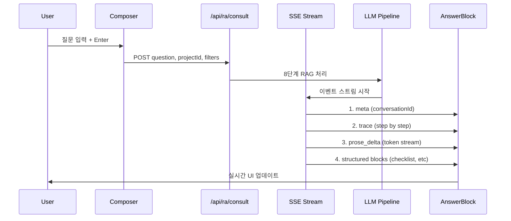
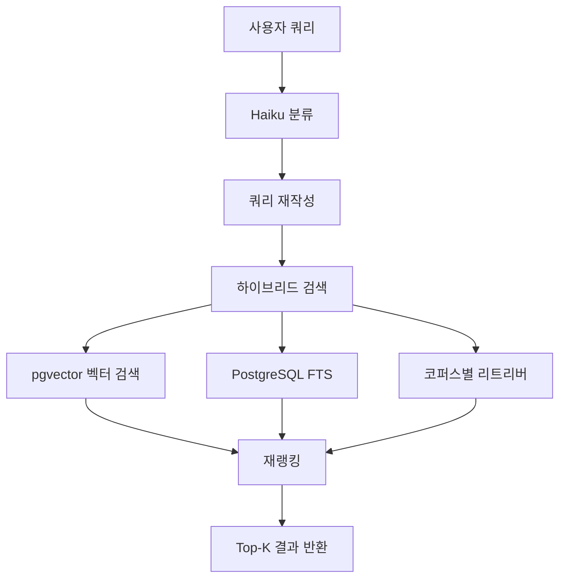
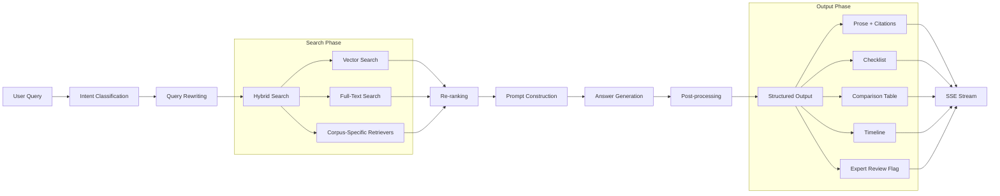

# 아키텍처 개요 — Regula

> 최종 업데이트: 2026-04-30
> 출처: `RA-bot-design/design_handoff_regula/README.md`

---

## 시스템 경계

Regula는 의료기기 규제(RA) 전문가 AI 챗봇으로, 4개 핵심 영역으로 구성된 마이크로서비스 아키텍처입니다.

### 주요 시스템 경계

```
┌─────────────────────────────────────────────────────────────────┐
│                        Frontend Layer                           │
│  ┌─────────────┐  ┌──────────────┐  ┌─────────────────────────┐ │
│  │ Next.js 15  │  │ React 18 +   │  │   Server Components    │ │
│  │ App Router  │  │ TypeScript   │  │   (RSC)                │ │
│  └─────────────┘  │ Tailwind v4 │  └─────────────────────────┘ │
│                    │ Radix UI    │                           │
│                    │ Zustand     │                           │
│                    │ TanStack    │                           │
└─────────────────────────────────────────────────────────────────┘
                           │
                           ↓ SSE
┌─────────────────────────────────────────────────────────────────┐
│                       API/Backend Layer                         │
│  ┌─────────────┐  ┌──────────────┐  ┌─────────────────────────┐ │
│  │ Next.js     │  │ Drizzle ORM  │  │    RAG Pipeline         │ │
│  │ Route       │  │ PostgreSQL   │  │    (8단계)              │ │
│  │ Handlers    │  │ + pgvector   │  │    + LangChain/LLM     │ │
│  └─────────────┘  │ + RLS       │  └─────────────────────────┘ │
│                    │ Auth.js      │                           │
│                    │ SSO/MFA      │                           │
└─────────────────────────────────────────────────────────────────┘
                           │
                           ↓
┌─────────────────────────────────────────────────────────────────┐
│                      Data Layer                                │
│  ┌─────────────┐  ┌──────────────┐  ┌─────────────────────────┐ │
│  │ PostgreSQL  │  │ pgvector     │  │   External Corpora     │ │
│  │ 16          │  │ 1536-dim    │  │   (FDA, EU MDR, MFDS)  │ │
│  │ + Audit Logs│  │ + FTS        │  │   + Internal SOPs     │ │
│  └─────────────┘  │ + Row-Level │  └─────────────────────────┘ │
│                    │ Security     │                           │
│                    │ 7년 보존     │                           │
└─────────────────────────────────────────────────────────────────┘
                           │
                           ↓
┌─────────────────────────────────────────────────────────────────┐
│                       Observability                            │
│  ┌─────────────┐  ┌──────────────┐  ┌─────────────────────────┐ │
│  │ Sentry     │  │ PostHog     │  │    Langfuse            │ │
│  │ Error      │  │ Analytics   │  │    LLM Traces          │ │
│  │ Tracking   │  │ Product     │  │    Cost Monitoring     │ │
│  └─────────────┘  │ Insights   │  └─────────────────────────┘ │
│                    │             │                           │
└─────────────────────────────────────────────────────────────────┘
```

---

## 핵심 아키텍처 패턴

### App Router Route Groups 패턴
Next.js 15의 Route Groups를 사용하여 인증 경계를 명확히 분리합니다.

```mermaid
graph LR
    A[Root Layout] --> B[(auth)]
    A --> C[(app)]
    
    B --> D[/login]
    B --> E[/sso/callback]
    
    C --> F[/ - Home]
    C --> G[/chat - 상담]
    C --> H[/history - 이력]
    C --> I[/templates - 템플릿]
    C --> J[/knowledge - 지식베이스]
    C --> K[/updates - 규제업데이트]
    C --> L[/dashboard - 대시보드]
    
    C --> M[Sidebar + Topbar Shell]
    C --> N[공통 Layout 공유]
```

### Server/Client Components 패턴
React 18의 서버/클라이언트 컴포넌트 구분을 통해 성능과 SEO를 최적화합니다.

| 컴포넌트 유형 | 위치 | 특징 |
|---|---|---|
| **Server Components** | app/\(app\)/views/, app/\(app\)/layout.tsx | RSC로 스트리밍 HTML, 초기 로딩 성능 |
| **Client Components** | components/\*/, app/\(app\)/chat/ | 인터랙션, 상태 관리, 스트리밍 훅 |
| **Server Actions** | app/api/\*/route.ts | 서버 사이드 API 처리 |

### SSE 스트리밍 패턴
실시간 답변 생성을 위한 Server-Sent Events 계약.



### 하이브리드 검색 패턴
벡터 검색과 전문 검색의 장점을 결합한 검색 파이프라인.



---

## 주요 아키텍처 결정

### 1. 백엔드 우선 구현 전략
**의사결정**: API 엔드포인트 → RAG 파이프라인 → UI 컴포넌트 순서로 구현

**이유**:
- API 계약 안정성 확보
- 프론트엔드-백엔드 의존성 관리
- RAG 파이프라인 로직 검증
- 데이터 모델의 타입 안전성 보장

**영향**:
- 개발 순서 엄격 준수 필요 (§2)
- 컴포넌트 간 의존성 명확화
- API 설계 변경 시 조기 검증

### 2. 다중 LLM 접근 방식
**의사결정**: Claude Sonnet 4.5 (추론) + Claude Haiku 4.5 (분류/라우팅)

**이유**:
- 최적화된 비용-성능 비율
- 작업별 특화 모델 배치
- abyz-lab 통합 접근 단순화

**영향**:
- LLM API 호출 최적화
- 프롬프트 엔지니어링 분리
- 모델별 오류 처리 필요

### 3. PostgreSQL + pgvector 선택
**의사결정**: 전통 관계형 DB + 벡터 확장자 조합

**이유**:
- ACID 트랜잭션 보장
- PostgreSQL FTS 통합 용이
- RLS(Row-Level Security) 지원
- 비용 효율성

**영향**:
- 스키마 설계 복잡성 증가
- 벡터 검색 최적화 필요
- 백업 및 관리 용이성

### 4. 21 CFR Part 11 감사 로깅
**의사결정**: 불변 append-only audit_logs 테이블, 7년 보존

**이유**:
의료기기 산업의 규제 요구사항 충족
- 모든 LLM 호출 기록
- 출처 접근 추적
- 전문가 검토 플래그 추적

**영향**:
- DB 스키마 강제 요구
- 성능 저하 발생 가능
- 보관 전략 필요

### 5. 실시간 UI 업데이트 전략
**의사결정**: SSE + 구조화 데이터 전달 (triple-streaming)

**이유**:
- 사용자 경험 개선
- 실시간 피드백 제공
- 답변 생성 과정 투명화

**영향**:
- 프론트엔드 복잡성 증가
- 상태 관리 필요성
- 오류 처리 복잡성

---

## 아키텍처 다이어그램

### 전체 시스템 아키텍처
```mermaid
graph TB
    subgraph "Frontend Layer (Next.js 15)"
        A1[App Router]
        A2[Server Components]
        A3[Client Components]
        A4[SSR Pages]
        A5[SSE Streaming]
    end
    
    subgraph "API Layer (Next.js Routes)"
        B1[/api/ra/consult]
        B2[/api/ra/conversations]
        B3[/api/ra/sources]
        B4[/api/ra/templates]
        B5[/api/ra/updates]
        B6[/api/ra/projects]
        B7[/api/ra/expert-review]
    end
    
    subgraph "AI/RAG Layer (LangChain/LLM)"
        C1[RAG Pipeline]
        C2[Intent Classifier]
        C3[Query Rewriter]
        C4[Hybrid Search]
        C5[Re-ranker]
        C6[Answer Generator]
        C7[Post-processor]
    end
    
    subgraph "Data Layer (PostgreSQL + pgvector)"
        D1[Users]
        D2[Organizations]
        D3[Projects]
        D4[Conversations]
        D5[Messages]
        D6[Sources]
        D7[Source Sections]
        D8[Message Sources]
        D9[Checklist Items]
        D10[Audit Logs]
    end
    
    subgraph "External Layer"
        E1[FDA Database]
        E2[EU MDR]
        E3[MFDS]
        E4[Internal SOPs]
        E5[S3/R2 Storage]
    end
    
    A1 --> B1
    B1 --> C1
    C1 --> D1
    C1 --> D2
    C1 --> D3
    C1 --> D6
    C1 --> E1
    C1 --> E2
    C1 --> E3
    C1 --> E4
    
    B1 --> A5
    B2 --> A1
    B3 --> A3
```

### RAG 파이프라인 아키텍처


---

## 아키텍처 제약 조건

### 1. 규제 준수 제약
- **21 CFR Part 11**: 모든 LLM 호출 기록, 출처 추적 필수
- **데이터 거버넌스**: EU 고객 → EU-호스팅, 조직별 설정 가능
- **보안 헤더**: CSP strict, HSTS, X-Frame-Options: DENY

### 2. 성능 제약
- **LCP ≤ 2.0s**: 초기 로딩 성능
- **INP ≤ 200ms**: 인터랙션 응답성
- **First token ≤ 1.5s**: 실시간 응답 속도
- **실시간 스트리밍**: 사용자 경험 개선

### 3. 접근성 제약
- **WCAG 2.1 AA**: 모든 UI 요소 키보드 접근성
- **스크린 리더 호환성**: 시각적 요소의 의미 전달
- **감소된 애니메이션**: prefers-reduced-motion 존중

### 4. 기술 제약
- **Next.js 15 App Router**: 최신 React 18 기능 활용
- **TypeScript 5.4+**: 타입 안전성 강화
- **Zod 스키마**: 클라이언트/서버 공유 타입
- **pnpm 패키지 관리**: 의존성 관리 표준화

---

## 관련 핸드오프 섹션

- §4 Recommended Tech Stack — 기술 스택 선택 근거
- §5 Project Structure — 폴더 구조 및 컴포넌트 경계
- §6 Design Tokens — 디자인 토큰 매핑 전략
- §11 Backend Integration & API Contracts — SSE 이벤트 타입
- §12 Data Models — Drizzle 스키마 설계
- §14 Accessibility — 접근성 요구사항
- §15 Performance & SEO — 성능 최적화 전략
- §16 Security & Compliance — 보안 및 규제 준수