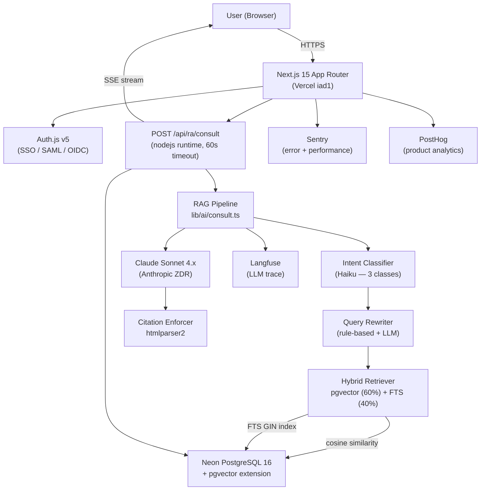
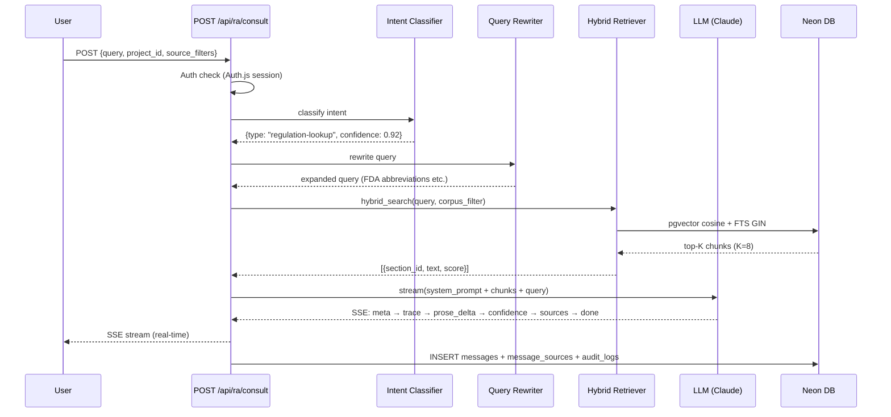
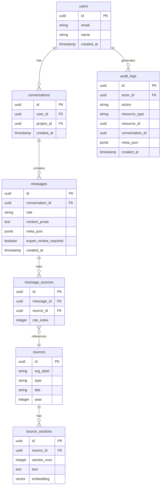
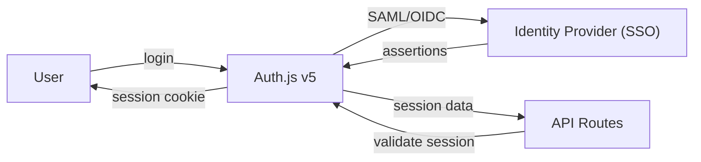
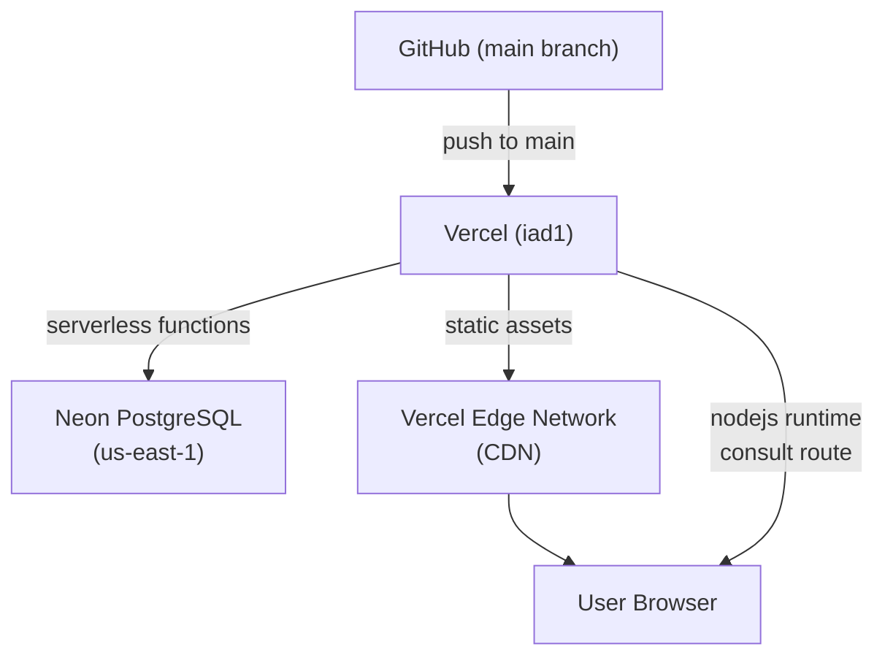

# Regula — System Architecture

> Version: 1.0.0 | Updated: 2026-05-03

---

## 1. High-Level Overview

Regula is a **regulatory affairs (RA) expert chatbot** for medical device professionals. It combines a **Next.js 15 App Router** frontend with a **RAG (Retrieval-Augmented Generation) pipeline** backed by **Neon PostgreSQL + pgvector**, deployed on **Vercel**.

---

## 2. Request Flow

### 2.1 Consultation Request (Happy Path)

### 2.2 SSE Event Order (Invariant)

Phase A events must precede Phase B, which must precede Phase C:

| Phase | Events |
|-------|--------|
| A — Setup | `meta`, `trace` |
| B — Content | `prose_delta`, `checklist`, `comparison`, `timeline`, `related` |
| C — Epilogue | `confidence`, `sources`, `expert_review_required`, `done`, `error` |

---

## 3. Database Schema

### Key Constraints

- `audit_logs`: append-only — UPDATE/DELETE/TRUNCATE are blocked at database level
- `source_sections.embedding`: 1536-dimensional vector (OpenAI `text-embedding-3-small`)
- `messages.expert_review_required`: set when confidence < 0.6 or query contains high-risk terms

---

## 4. Corpus Architecture

Six regulatory corpora are indexed in `source_sections`:

| Corpus | Coverage | Chunks (~) |
|--------|----------|-----------|
| FDA | 21 CFR Part 807/820/814, 510(k), PMA, De Novo | 650 |
| EU MDR | Regulation (EU) 2017/745, MDR Annexes | 400 |
| MFDS | Korean medical device regulations | 300 |
| NMPA | China NMPA device registration | 200 |
| PMDA | Japan PMDA approval process | 200 |
| Internal SOP | Company SOPs, policies | 150 |

Retrieval: `hybrid_search` combines pgvector cosine similarity (weight 0.6) and PostgreSQL FTS GIN index (weight 0.4).

---

## 5. Authentication Architecture

All `/api/ra/*` routes require a valid Auth.js session. Unauthenticated requests receive HTTP 401.

---

## 6. Deployment Architecture

- **Consult route**: `nodejs` runtime (not Edge) — required for pgvector native bindings
- **All other API routes**: default Next.js runtime (30s timeout)
- **Static assets**: served via Vercel Edge CDN globally

---

## 7. Security Architecture

| Layer | Control |
|-------|---------|
| Transport | HTTPS + HSTS (`max-age=31536000; includeSubDomains; preload`) |
| Framing | `X-Frame-Options: DENY` |
| MIME sniffing | `X-Content-Type-Options: nosniff` |
| Auth | Auth.js v5 session (signed JWT, HttpOnly cookies) |
| LLM data | Anthropic ZDR (`anthropic-beta: zero-data-retention`) |
| Error tracking | Sentry `beforeSend` PII redaction (query, user_id, content, email) |
| Secrets | gitleaks CI scan on every push |
| Dependencies | `pnpm audit --audit-level=high` in CI |

For full security documentation, see [`docs/security/`](security/).

---

## 8. Observability

| Tool | Purpose | Data |
|------|---------|------|
| Sentry | Error tracking + performance | Exceptions, slow requests |
| PostHog | Product analytics | User flows, feature usage |
| Langfuse | LLM trace | Token usage, latency, eval scores |
| Vercel Analytics | Core Web Vitals | LCP, INP, CLS |

Observability is strictly separated from `audit_logs` — observability tools never write to the audit table.
