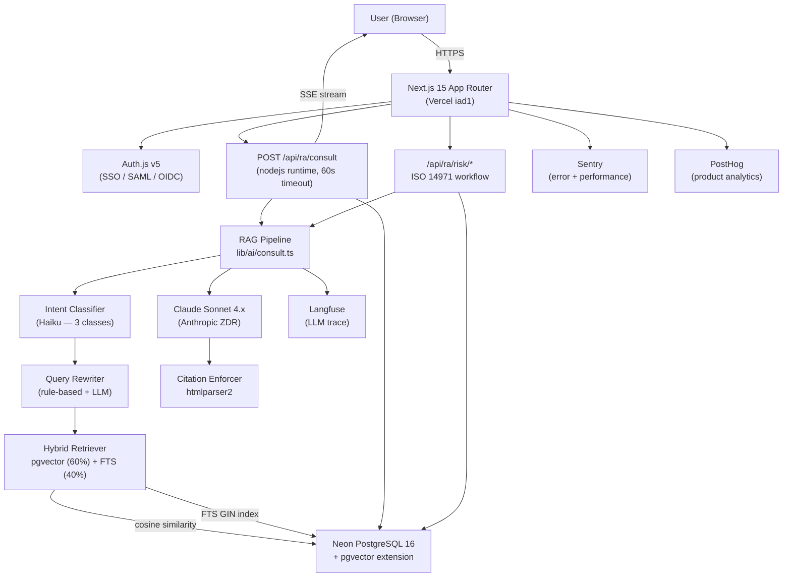
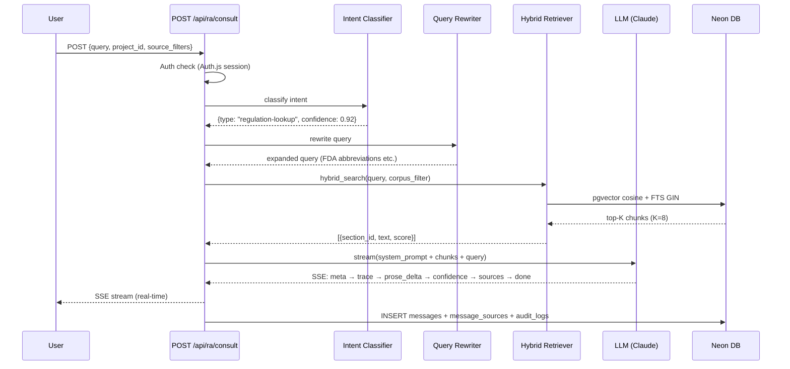
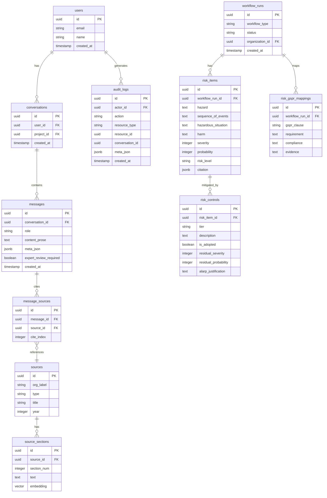
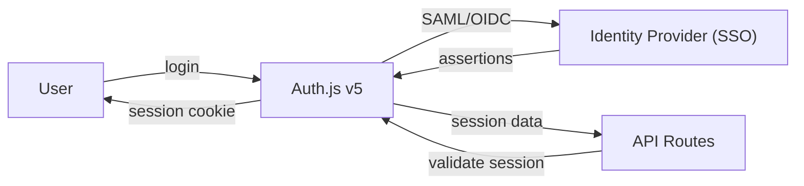
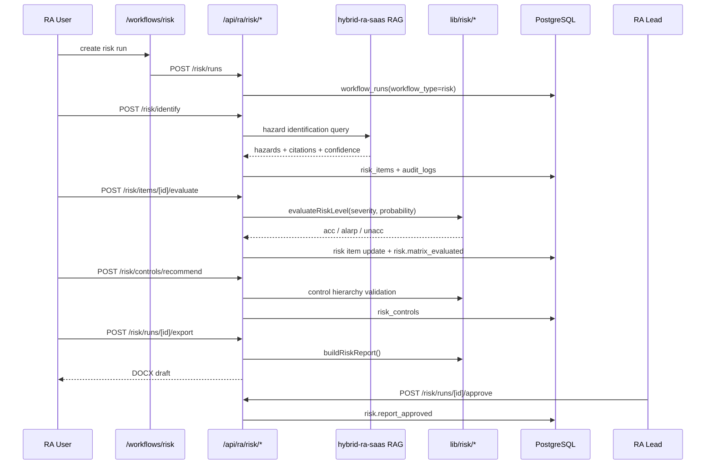
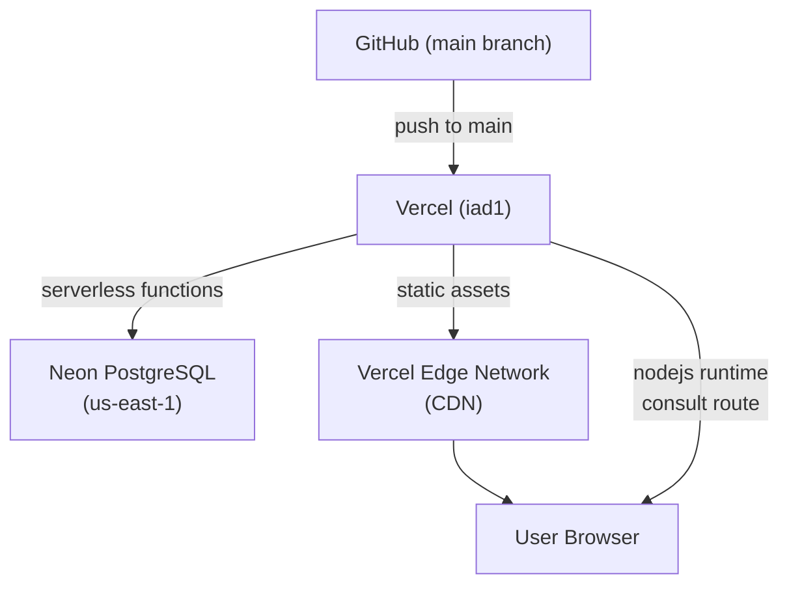

# Regula — System Architecture

> Version: 1.1.0 | Updated: 2026-06-20

---

## 1. High-Level Overview

Regula is a **regulatory affairs (RA) expert chatbot** for medical device professionals. It combines a **Next.js 15 App Router** frontend with a **RAG (Retrieval-Augmented Generation) pipeline** backed by **Neon PostgreSQL + pgvector**, deployed on **Vercel**.

---

## 2. Request Flow

### 2.1 Consultation Request (Happy Path)

### 2.2 SSE Event Order (Invariant)

Phase A events must precede Phase B, which must precede Phase C:

| Phase | Events |
|-------|--------|
| A — Setup | `meta`, `trace` |
| B — Content | `prose_delta`, `checklist`, `comparison`, `timeline`, `related` |
| C — Epilogue | `confidence`, `sources`, `expert_review_required`, `done`, `error` |

---

## 3. Database Schema

### Key Constraints

- `audit_logs`: append-only — UPDATE/DELETE/TRUNCATE are blocked at database level
- `source_sections.embedding`: 1536-dimensional vector (OpenAI `text-embedding-3-small`)
- `messages.expert_review_required`: set when confidence < 0.6 or query contains high-risk terms
- `risk_items`: stores ISO 14971 hazard / event sequence / hazardous situation / harm terms with citation metadata
- `risk_controls`: stores ISO 14971 §7.1 control hierarchy and residual risk evaluation
- `risk_gspr_mappings`: maps risk file evidence to EU MDR Annex I GSPR clauses

---

## 4. Corpus Architecture

Six regulatory corpora are indexed in `source_sections`:

| Corpus | Coverage | Chunks (~) |
|--------|----------|-----------|
| FDA | 21 CFR Part 807/820/814, 510(k), PMA, De Novo | 650 |
| EU MDR | Regulation (EU) 2017/745, MDR Annexes | 400 |
| MFDS | Korean medical device regulations | 300 |
| NMPA | China NMPA device registration | 200 |
| PMDA | Japan PMDA approval process | 200 |
| Internal SOP | Company SOPs, policies | 150 |

Retrieval: `hybrid_search` combines pgvector cosine similarity (weight 0.6) and PostgreSQL FTS GIN index (weight 0.4).

---

## 5. Authentication Architecture

All `/api/ra/*` routes require a valid Auth.js session. Unauthenticated requests receive HTTP 401.

---

## 6. Risk Management Architecture

The ISO 14971 Risk Management workflow is a regulated workflow surface layered on top of the same Auth.js, Drizzle, audit, and hybrid-ra-saas integration primitives used by the rest of Regula.

### Risk bounded context

| Layer | Module | Responsibility |
|---|---|---|
| UI | `components/risk/*` | Matrix, hazard table, control wizard, approval gate |
| API | `app/api/ra/risk/*` | Session/RBAC, BFF routing, audit writes |
| Domain | `lib/risk/*` | Matrix classification, residual risk, control hierarchy, report generation |
| Data | `risk_items`, `risk_controls`, `risk_gspr_mappings` | Workflow-scoped risk file records |
| Compliance | `audit_logs`, `risk.approve` | 21 CFR Part 11 traceability and RA-lead approval |

### Risk invariants

- `severity` and `probability` are integer scales from 1 to 5.
- Risk level is one of `acc`, `alarp`, `unacc`.
- `information` tier controls require rationale.
- Residual ALARP decisions require justification.
- Final approval uses server-side `risk.approve` and cannot be granted by RA member roles.

---

## 7. Deployment Architecture

- **Consult route**: `nodejs` runtime (not Edge) — required for pgvector native bindings
- **All other API routes**: default Next.js runtime (30s timeout)
- **Static assets**: served via Vercel Edge CDN globally

---

## 8. Security Architecture

| Layer | Control |
|-------|---------|
| Transport | HTTPS + HSTS (`max-age=31536000; includeSubDomains; preload`) |
| Framing | `X-Frame-Options: DENY` |
| MIME sniffing | `X-Content-Type-Options: nosniff` |
| Auth | Auth.js v5 session (signed JWT, HttpOnly cookies) |
| RBAC | `withPermission` matrix, including risk.generate/view/update/approve |
| Risk approval | `risk.approve` RA-lead-only final report gate |
| LLM data | Anthropic ZDR (`anthropic-beta: zero-data-retention`) |
| Error tracking | Sentry `beforeSend` PII redaction (query, user_id, content, email) |
| Secrets | gitleaks CI scan on every push |
| Dependencies | `pnpm audit --audit-level=high` in CI |

For full security documentation, see [`docs/security/`](security/).

---

## 9. Observability

| Tool | Purpose | Data |
|------|---------|------|
| Sentry | Error tracking + performance | Exceptions, slow requests |
| PostHog | Product analytics | User flows, feature usage |
| Langfuse | LLM trace | Token usage, latency, eval scores |
| Vercel Analytics | Core Web Vitals | LCP, INP, CLS |

Observability is strictly separated from `audit_logs` — observability tools never write to the audit table.

---

## 10. Codebase Analysis (2026-06-20)

### 9.1 Project Scale

- **TypeScript files**: 400+
- **API routes**: 77+
- **Database tables**: 21+
- **lib modules**: 27
- **components categories**: 11

### 9.2 Module Structure

**12 Core Modules**:
1. `app/(auth)` - Authentication and login pages
2. `app/(app)` - Main application layout and routing
3. `components/shell` - Application shell (Sidebar, Topbar)
4. `components/chat` - Chat components (Composer, AnswerBlock, etc.)
5. `components/views` - Page-specific components
6. `components/primitives` - Basic UI elements
7. `lib/ai` - RAG pipeline and AI logic
8. `lib/db` - Database schema and queries
9. `lib/auth` - Authentication logic
10. `hooks` - Custom React hooks
11. `stores` - Client state management
12. `lib/i18n` - Internationalization

### 9.3 Dependency Breakdown

**Frontend (30+)**:
- Next.js 15, React 18, TypeScript 5.4+
- Radix UI, Tailwind v4, Zustand, TanStack Query v5

**Backend (25+)**:
- Node.js 20+, Drizzle ORM, PostgreSQL 16+pgvector
- Auth.js v5, Zod validation

**AI/ML (20+)**:
- abyz-lab Sonnet 4.5, Haiku 4.5
- LangChain, Cohere Rerank
- OpenAI embedding

**Database (15+)**:
- PostgreSQL 16, pgvector extension
- Full-text search, RLS policies

**Dev Tools (20+)**:
- Biome (lint/format), Vitest (testing)
- Playwright (E2E), Storybook (components)

### 9.4 Key Architecture Decisions

1. **Backend-first implementation** - API → RAG → UI order
2. **Multi-LLM strategy** - Sonnet (inference) + Haiku (classification)
3. **PostgreSQL + pgvector** - ACID transactions + vector search
4. **21 CFR Part 11 audit logging** - Immutable append-only logs, 7-year retention
5. **SSE streaming** - Real-time UI updates with structured data

For detailed codemaps, see:
- `.moai/project/codemaps/overview.md`
- `.moai/project/codemaps/modules.md`
- `.moai/project/codemaps/dependencies.md`
- `.moai/project/codemaps/entry-points.md`
- `.moai/project/codemaps/data-flow.md`
