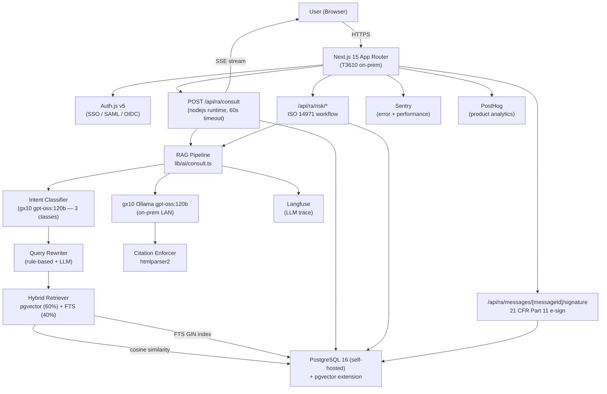
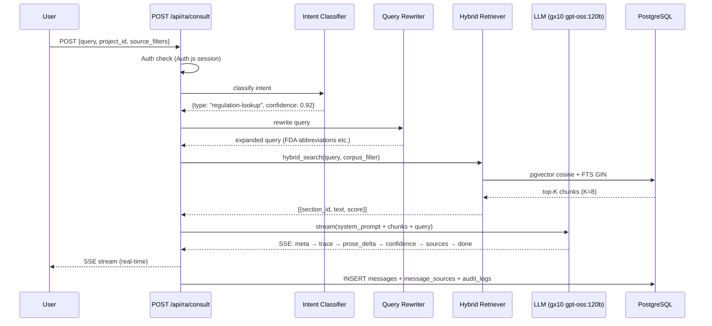
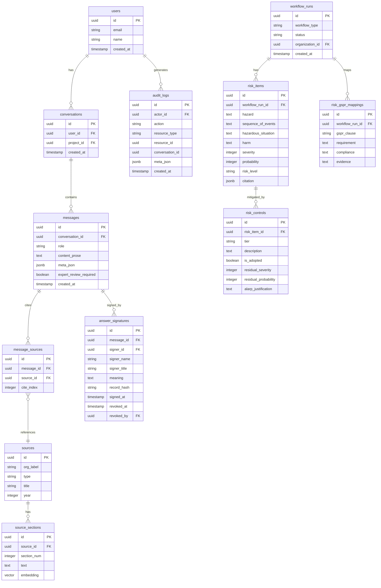
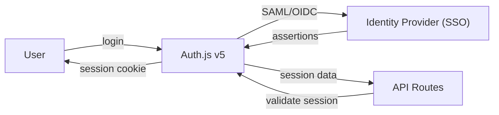
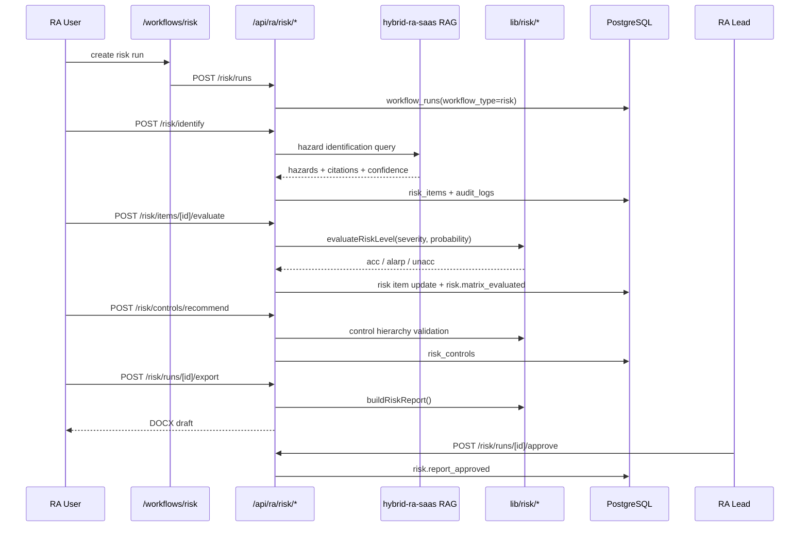
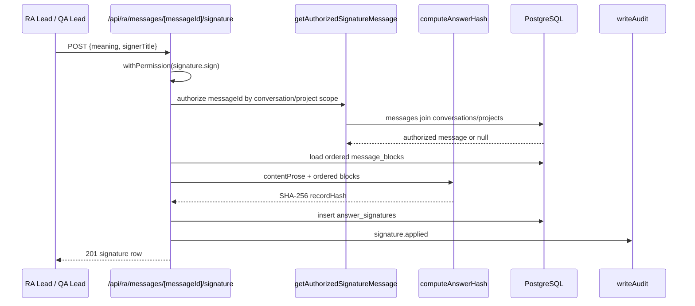
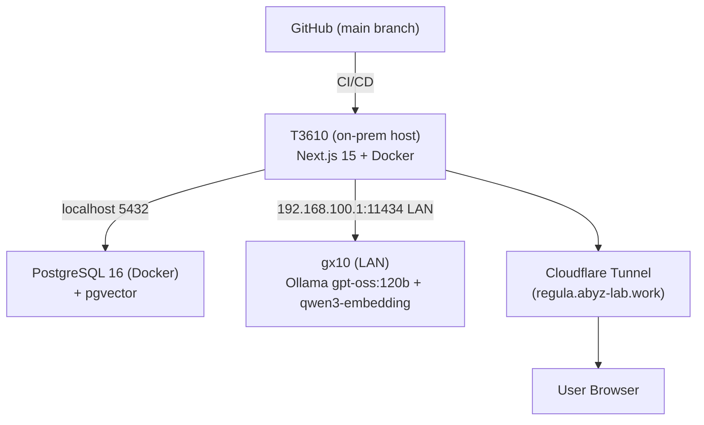

# Regula — System Architecture

> Version: 1.3.0 | Updated: 2026-07-18

> **인프라 정정 (2026-07-18, #519 후속)**: v1.2.0(2026-06-21)까지 이 문서는 Vercel + Neon +
> Anthropic Claude Sonnet + OpenAI 임베딩을 "현재 아키텍처"로 서술했으나, 이는 **stale**하다.
> `#318`(gx10 온프레미스 Ollama 단일화)과 배포 전환으로 실제 아키텍처가 바뀌었다. 권위 문서는
> `.moai/project/tech.md` v3.0.0. 아래는 실제 인프라로 정정한 내용이다:
> - LLM: ~~Claude Sonnet 4.x (Anthropic ZDR)~~ → **gx10 온프레미스 Ollama `gpt-oss:120b`** (LAN, 외부 API 배제)
> - 임베딩: ~~OpenAI `text-embedding-3-small`~~ → **gx10 `qwen3-embedding`** (1536-dim MRL truncation)
> - DB: ~~Neon PostgreSQL~~ → **자체호스팅 PostgreSQL 16 + pgvector** (Docker 컨테이너)
> - 배포: ~~Vercel (iad1)~~ → **T3610 로컬 + Cloudflare Tunnel** (`regula.abyz-lab.work`, 완전 내부망)

---

## 1. High-Level Overview

Regula is a **regulatory affairs (RA) expert chatbot** for medical device professionals. It combines a **Next.js 15 App Router** frontend with a **RAG (Retrieval-Augmented Generation) pipeline** backed by **self-hosted PostgreSQL 16 + pgvector**, deployed on **T3610 (on-prem) via Cloudflare Tunnel** — 완전 내부망 운영, 외부 클라우드(Vercel/Neon/AWS) 없음.

---

## 2. Request Flow

### 2.1 Consultation Request (Happy Path)

### 2.2 SSE Event Order (Invariant)

Phase A events must precede Phase B, which must precede Phase C:

| Phase | Events |
|-------|--------|
| A — Setup | `meta`, `trace` |
| B — Content | `prose_delta`, `checklist`, `comparison`, `timeline`, `related` |
| C — Epilogue | `confidence`, `sources`, `expert_review_required`, `done`, `error` |

---

## 3. Database Schema

### Key Constraints

- `audit_logs`: append-only — UPDATE/DELETE/TRUNCATE are blocked at database level
- `source_sections.embedding`: 1536-dimensional vector (gx10 `qwen3-embedding`, MRL truncation)
- `messages.expert_review_required`: set when confidence < 0.6 or query contains high-risk terms
- `answer_signatures`: one active non-revoked signature per answer; stores §11.50 manifestation fields and §11.70 record hash
- `risk_items`: stores ISO 14971 hazard / event sequence / hazardous situation / harm terms with citation metadata
- `risk_controls`: stores ISO 14971 §7.1 control hierarchy and residual risk evaluation
- `risk_gspr_mappings`: maps risk file evidence to EU MDR Annex I GSPR clauses

---

## 4. Corpus Architecture

Six regulatory corpora are indexed in `source_sections`:

| Corpus | Coverage | Chunks (~) |
|--------|----------|-----------|
| FDA | 21 CFR Part 807/820/814, 510(k), PMA, De Novo | 650 |
| EU MDR | Regulation (EU) 2017/745, MDR Annexes | 400 |
| MFDS | Korean medical device regulations | 300 |
| NMPA | China NMPA device registration | 200 |
| PMDA | Japan PMDA approval process | 200 |
| Internal SOP | Company SOPs, policies | 150 |

Retrieval: `hybrid_search` combines pgvector cosine similarity (weight 0.6) and PostgreSQL FTS GIN index (weight 0.4).

---

## 5. Authentication Architecture

All `/api/ra/*` routes require a valid Auth.js session. Unauthenticated requests receive HTTP 401.

---

## 6. Risk Management Architecture

The ISO 14971 Risk Management workflow is a regulated workflow surface layered on top of the same Auth.js, Drizzle, audit, and hybrid-ra-saas integration primitives used by the rest of Regula.

### Risk bounded context

| Layer | Module | Responsibility |
|---|---|---|
| UI | `components/risk/*` | Matrix, hazard table, control wizard, approval gate |
| API | `app/api/ra/risk/*` | Session/RBAC, BFF routing, audit writes |
| Domain | `lib/risk/*` | Matrix classification, residual risk, control hierarchy, report generation |
| Data | `risk_items`, `risk_controls`, `risk_gspr_mappings` | Workflow-scoped risk file records |
| Compliance | `audit_logs`, `risk.approve` | 21 CFR Part 11 traceability and RA-lead approval |

### Risk invariants

- `severity` and `probability` are integer scales from 1 to 5.
- Risk level is one of `acc`, `alarp`, `unacc`.
- `information` tier controls require rationale.
- Residual ALARP decisions require justification.
- Final approval uses server-side `risk.approve` and cannot be granted by RA member roles.

---

## 7. Electronic Signature Architecture

The electronic signature bounded context implements 21 CFR Part 11 §11.50 manifestation and §11.70 signature/record linking for answer approvals.

### Signature bounded context

| Layer | Module | Responsibility |
|---|---|---|
| API | `app/api/ra/messages/[messageId]/signature/*` | Sign, manifestation lookup, revoke |
| Authorization | `lib/signature/authorization.ts` | Tenant/owner boundary for UUID-addressable message IDs |
| Domain | `lib/signature/hash.ts`, `lock.ts`, `queries.ts` | Hashing, active lock check, signature query helpers |
| UI/export | `components/chat/SignatureManifestation.tsx`, `lib/signature/pdf-inject.ts` | §11.50 displayed and printed manifestation |
| Compliance | `answer_signatures`, `audit_logs`, `signature.sign` | §11.50/§11.70 traceability and signing gate |

### Signature invariants

- Signature routes authorize the answer before any signature lookup or mutation.
- A signed answer is locked until the active signature is revoked.
- `qa-lead` can sign through `signature.sign.additionalRoles` but does not inherit unrelated `ra-lead` permissions.
- Signature audit events are append-only: `signature.applied`, `signature.revoked`.

---

## 8. Deployment Architecture

- **완전 내부망 운영**: 외부 클라우드(Vercel/Neon/AWS) 없음. T3610 on-prem 호스트에서 Docker로 Next.js + PostgreSQL 구동, LLM/임베딩은 gx10(LAN) 호출
- **외부 노출**: Cloudflare Tunnel로 `regula.abyz-lab.work` 서빙 (인바운드 포트 개방 없음)
- **Consult route**: `nodejs` runtime — pgvector native bindings 필요

---

## 9. Security Architecture

| Layer | Control |
|-------|---------|
| Transport | HTTPS + HSTS (`max-age=31536000; includeSubDomains; preload`) |
| Framing | `X-Frame-Options: DENY` |
| MIME sniffing | `X-Content-Type-Options: nosniff` |
| Auth | Auth.js v5 session (signed JWT, HttpOnly cookies) |
| RBAC | `withPermission` matrix, including risk.generate/view/update/approve |
| Risk approval | `risk.approve` RA-lead-only final report gate |
| Electronic signature | `signature.sign` RA-lead/admin + signature-specific QA lead gate |
| LLM data | gx10 온프레미스 Ollama (LAN) — 데이터가 내부망을 벗어나지 않음 (외부 API 배제, #318) |
| Error tracking | Sentry `beforeSend` PII redaction (query, user_id, content, email) |
| Secrets | gitleaks CI scan on every push |
| Dependencies | `pnpm audit --audit-level=high` in CI |

For full security documentation, see [`docs/security/`](security/).

---

## 10. Observability

| Tool | Purpose | Data |
|------|---------|------|
| Sentry | Error tracking + performance | Exceptions, slow requests |
| PostHog | Product analytics | User flows, feature usage |
| Langfuse | LLM trace | Token usage, latency, eval scores |
| Vercel Analytics | Core Web Vitals | LCP, INP, CLS |

Observability is strictly separated from `audit_logs` — observability tools never write to the audit table.

---

## 11. Codebase Analysis (2026-06-21)

### 11.1 Project Scale

- **TypeScript files**: 400+
- **API routes**: 77+
- **Database tables**: 21+
- **lib modules**: 27
- **components categories**: 11

### 11.2 Module Structure

**12 Core Modules**:
1. `app/(auth)` - Authentication and login pages
2. `app/(app)` - Main application layout and routing
3. `components/shell` - Application shell (Sidebar, Topbar)
4. `components/chat` - Chat components (Composer, AnswerBlock, etc.)
5. `components/views` - Page-specific components
6. `components/primitives` - Basic UI elements
7. `lib/ai` - RAG pipeline and AI logic
8. `lib/db` - Database schema and queries
9. `lib/auth` - Authentication logic
10. `hooks` - Custom React hooks
11. `stores` - Client state management
12. `lib/i18n` - Internationalization

### 11.3 Dependency Breakdown

**Frontend (30+)**:
- Next.js 15, React 18, TypeScript 5.4+
- Radix UI, Tailwind v4, Zustand, TanStack Query v5

**Backend (25+)**:
- Node.js 20+, Drizzle ORM, PostgreSQL 16+pgvector
- Auth.js v5, Zod validation

**AI/ML (20+)**:
- gx10 온프레미스 Ollama (gpt-oss:120b)
- LangChain, Cohere Rerank
- gx10 qwen3-embedding (1536-dim)

**Database (15+)**:
- PostgreSQL 16, pgvector extension
- Full-text search, RLS policies

**Dev Tools (20+)**:
- Biome (lint/format), Vitest (testing)
- Playwright (E2E), Storybook (components)

### 11.4 Key Architecture Decisions

1. **Backend-first implementation** - API → RAG → UI order
2. **Single on-prem LLM** - gx10 Ollama gpt-oss:120b (inference + classification, 외부 API 배제 #318)
3. **PostgreSQL + pgvector** - ACID transactions + vector search
4. **21 CFR Part 11 audit and signatures** - Immutable audit logs plus hash-linked electronic signatures
5. **SSE streaming** - Real-time UI updates with structured data

For detailed codemaps, see:
- `.moai/project/codemaps/overview.md`
- `.moai/project/codemaps/modules.md`
- `.moai/project/codemaps/dependencies.md`
- `.moai/project/codemaps/entry-points.md`
- `.moai/project/codemaps/data-flow.md`
